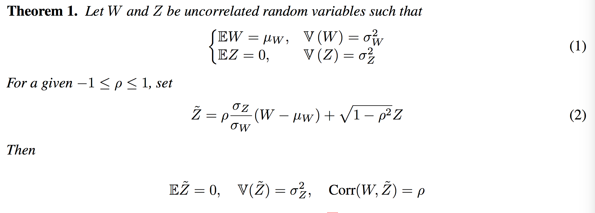
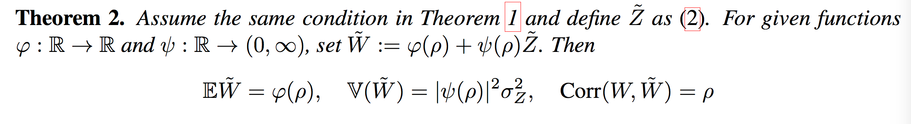
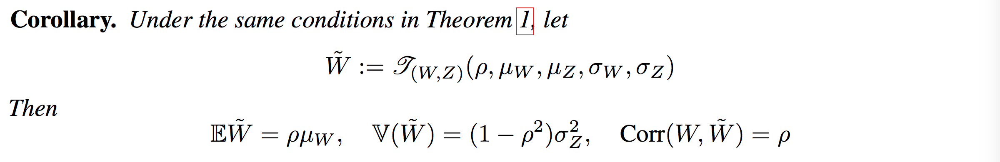
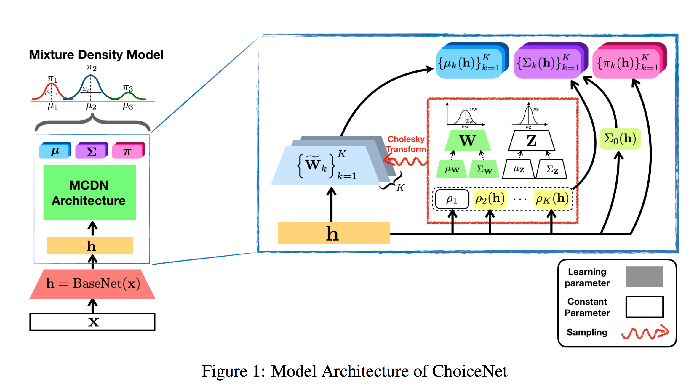
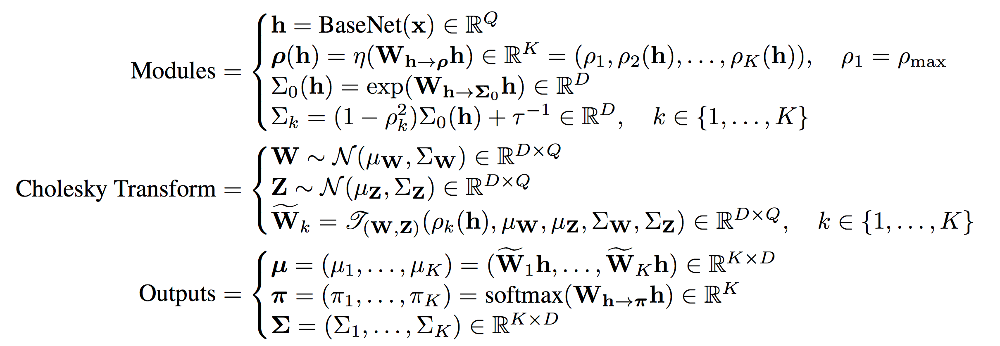
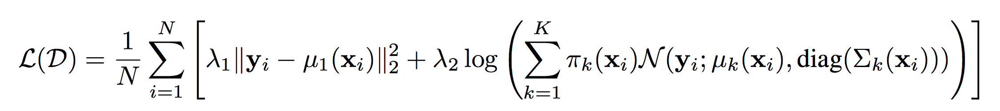
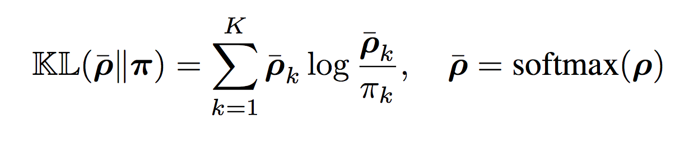
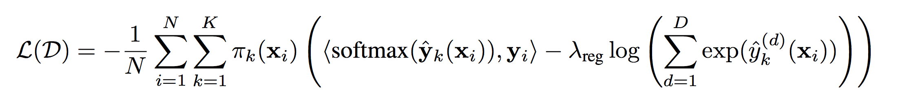

# ChoiceNet: Robust Learning by Revealing Output Correlations

#### Sungjoon Choi, Sanghoon Hong, Sungbin Lim (Kakao Brain, 2018)

* implementation : https://github.com/sjchoi86/choicenet

## Introduction
* 딥러닝 모델을 학습시키는 것은 크라우드 소싱 방법(Amazno's Mechanical Turk(AMT)) 등으로 수집된 방대한 양의 학습데이터가 필요하다. 하지만 현실적으로 크라우드 소싱에 의한 라벨들은 종종 노이즈를 포함하고 있다. 
* 딥러닝모델은 라벨 데이터에 일관성이 없더라도 전체 데이터셋을 모두 기억하려는 경향이 있기때문에 노이즈가 포함된 학습데이터는 오버피팅을 야기하게 되고, 이로 인해 모델 일반화에 어려움을 겪게 된다. 

* 본 논문에서는 학습 데이터가 타겟 분포과 노이즈 분포의 mixture로부터 만들어졌다고 가정하고, 타겟 분포와 노이즈 분포 사이의 correlation을 추적해나가는 방식을 제시하였다.  
* 이를 통해 CNN, RNN과 같은 임의 신경망 구조에 적용가능하면서 노이즈 데이터에 더 로버스트한 모델을 end-to-end 방식으로 학습시킬수 있는 새로운 프레임워크, <i><u>ChoiceNet</u></i>를 제안하였다. 

* 이 논문은 아래 2가지 질문에 답을 제시한다. 
	* 이론적으로 학습데이터의 quality를 어떻게 측정할 것인가? - 이 질문에 답하기 위해 학습데이터로부터 생성된 분포와 타겟 분포 사이의 correlation 개념을 도입하였다. 하지만 correlation을 측정하기 위해서 타겟 분포를 알아야하고, 타겟 분포를 학습하기 위해서는 이미 알고 있다고 가정하는 두 분포사이의 correlation을 알아야하기 때문에 이 문제는 chicken-and-egg 문제가 된다. 

	* 학습데이터에 노이즈가 포함되어 있을때, 확장가능한 방식으로(임의 신경망 구조에 대해) 타겟 분포를 어떻게 추정할수 있을것인가? - 두번째 질문에 답하기 위해 stochastic gradient decent 방법(Adam 사용)을 사용하여 end-to-end방식으로 correlation과 타겟 분포를 동시에 추정가능하도록 하였다.

* <i>제안한 방법의 핵심은 <u>mixture of correlated density network(MCDN) bolck</u>이다. 이 방법은 correlated ouput을 모델링하도록 신경망의 가중치를 샘플링하는 <u>Cholesky tranform method</u>를 기반으로 한다.</i> 본 논문은 end-to-end 방식으로 타겟 분포를 추정함과 동시에 신경망의 아웃풋 correlation를 동시에 추론하는 최초 접근이라는 점에 의의가 있다.

## Related Work : TBU

## ChoiceNet

### Reparameterization Trick for Correlated Sampling
* 여기서는 Cholesky transform 을 설명하기 위한 기본 이론들을 소개한다.

</img>

* W와 Z가 각각 평균은 μW와 0, 분산은 σW2와 σZ2을 갖고 uncorrelated random variable 일때, 
Z와 동일한 평균, 분산을 갖으면서 W와 ρ만큼의 상관관계를 갖는 Z ̃를 샘플링할수 있다. 

</img>

* 또한 주어진 함수 φ:R→R , ψ:R→(0,∞) 에 대해서   W ̃ := φ(ρ) + ψ(ρ)Z ̃로 정의하면 W ̃의 평균과 분산, W와의 상관관계는 각 0과 ,σZ2, ρ와 같아진다. 즉, mean-translation과 variance-dilatation에 대해서 상관관계는 불변한다. 

</img>

* 이 두가지 이론을 기반으로 MCDN block의 핵심 연산인 Cholesky Transform,  T(W, Z)은 위와 같이 정의한다. 주어진 W와 Z를 이용해 T(W, Z) 연산을 하면, W와 correlated된 새로운 랜덤 변수  W ̃를 얻을수 있다. 

</img>

* theorem2에 T(W, Z)를 대입해보면 φ(ρ) = ρμW이고, ψ(ρ) = root(1−ρ2) 에 해당한다. 따라서 T(W, Z) 연산을 통해 얻게 되는 새로운 랜덤 변수 W ̃는 W와 ρ만큼의 상관관계를 갖게 되며, 평균과 분산은 ρμW, (1−ρ2)σZ2가 된다.

### Model Architecture

</img>

</img>

### Training Objectives

* __regression__ : L2 loss와 기본적인 MDN loss를 사용한다. 또한 weight decay와 KL regularizer를 사용하였다. KL regularizer는 상관관계가 높은 믹스쳐 컴포넌트가 높은 확률을 갖도록 도와준다. 
</img>
</img>

* __classification__ : yi가 D-dimensional one-hot vector라고 가정한다. regression과 마찬가지로 KL regularizer와 weight decay를 사용한다.
</img>

