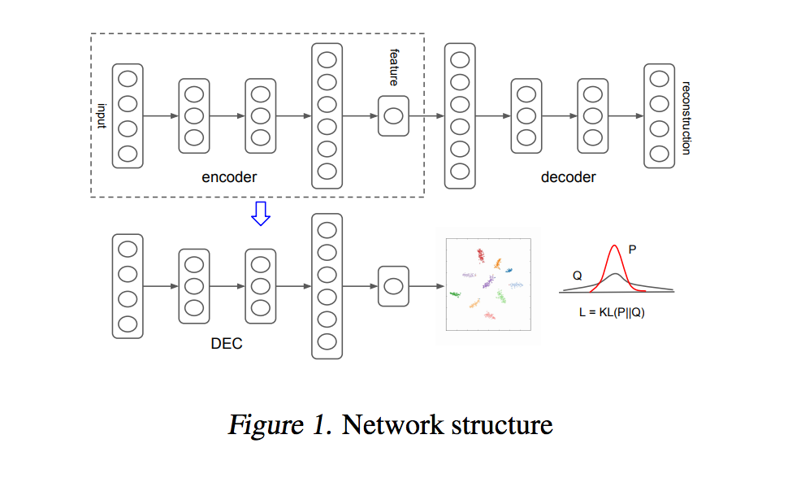
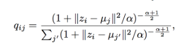
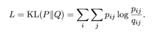
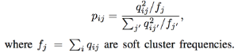
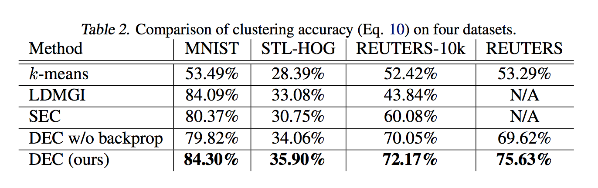
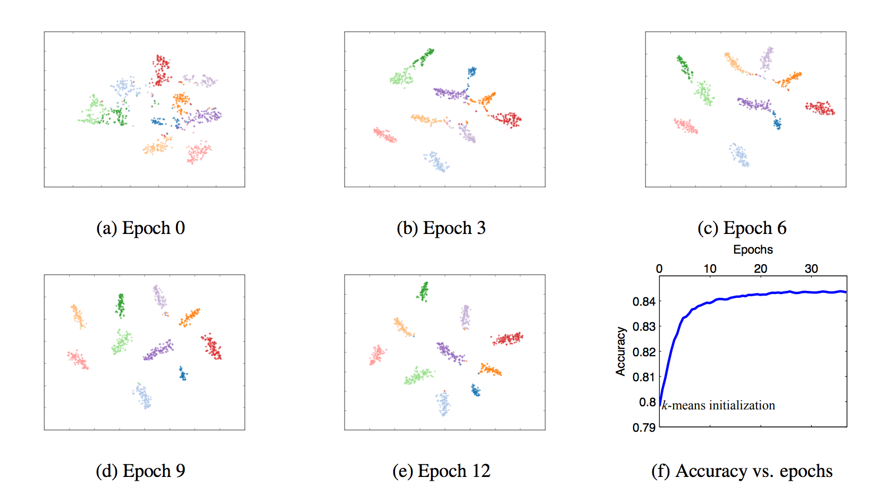
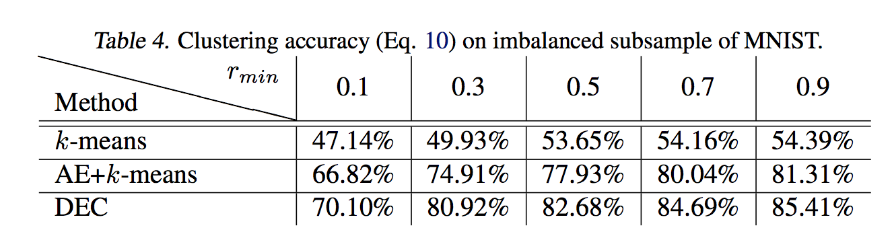
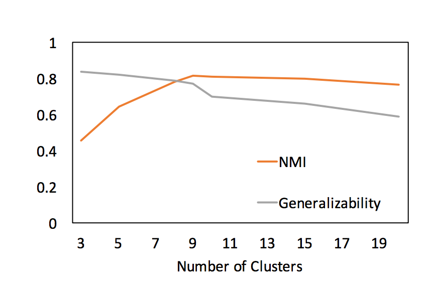
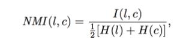
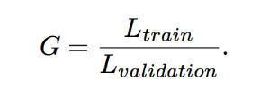

### Unsupervised Deep Embedding for Clustering Analysis
#### J. Xie, R. Girshick, A. Farhadi (University of Washington, Facebook AI Reaserch), 2016

#### keras implementation : https://github.com/XifengGuo/DEC-keras

* 클러스터링은 데이터 분석 및 시각화를 위한 핵심 방법입니다. 
* 하지만 아직까지도 어떻게 좋은 클러스터를 찾고, 어떤 distance 지표가 올바른 것인지에 대한 논의는 지속되고 있습니다. 
* 이 논문에서는 딥러닝 모델을 통해서 embedding과 clustering 과정을 동시에 고려하여 최적 클러스터를 찾는 방법(DEC)을 제안합니다. 
* DEC는 feature representation과 cluster assignments를 동시에 학습합니다. 
* 클러스터링 목적을 최적화하는 방향으로 입력 데이터를 저차원의 피쳐공간으로 맵핑시킵니다.

### contribution
* 임베딩과 클러스터링을 동시에 최적화시킵니다.
* 소프트 어싸인을 통해 점진적으로 향상시킵니다.
* 클러스터링 정확도와 속도 측면에서 좋은 성능(state-of-the art)을 보였습니다. 

### DEC consists of two phase
</img>

#### 1) pretrain : parameter initialization with deep autoencoder
* 먼저 오토인코더를 학습합니다.
* 학습된 오토인코더 중 인코더 부분만 사용하여 압축된 latent vector값으로 k- means 클러스터링을 합니다.
* k-means로 계산된 클러스터의 centroid는 이니셜값으로 사용합니다. phase 2 과정으로 최적화시킵니다.

#### 2) DEC train : parameter optimization to minimize KL divergence between auxiliary target distribution and cluster assignment distribution (soft assignment)
* phase2는 보조 역할을 하는 타겟분포를 이용해 클러스터 할당 정보로부터 아래 목적으로 학습이 됩니다.
* 한 클러스터 속하는 샘플들은 더 가깝고, 다른 클러스터간의 거리는 멀어지도록 합니다.
* 학습 과정에서 초기의 인코더 파라미터가 업데이트되면서 latent vector도 업데이트됩니다.

* 먼저 centroid uj (j번째 클러스터의 중심값)과 zi(i번째 데이터의 잠재벡터)를 이용해 i번째 데이터가 j번째 클러스터에 속할 확률 qij를 구합니다 – soft assignment

    </img>

* 두번째로는 소프트 어싸인(qij)과 타겟분포(pij)사이의 거리를 KL divergence를 사용하여 정의합니다. - loss function

    </img>

* pij(target distribution)를 구하는 것이 DEC의 퍼포먼스를 결정하는 핵심인데, 3가지 속성을 갖도록 정의하였습니다.
    * 클러스터 내 순도(purity)가 높아지도록 합니다.  strengthen predictions (imporve cluster purity)
    * 높은 신뢰도를 갖는 할당에 더 가중치를 줍니다. put more emphasis on data points assigned with high confidence
    * 클러스터 사이즈로 손실함수 값을 정규화합니다. 클러스터 사이즈가 클수록 손실함수에 주는 기여도가 커서 전체 피쳐 공간을 왜곡시키는 것을 방지하기 위해서입니다. normalize loss constribution of each centroid to prevent large clusters from distorting the hidden feature space 
    
    </img>

* 이러한 방식은 self-training의 관점으로 높은 신뢰도를 갖는 예측을 더 강화하는 방향으로 최적화 시키는 것입니다.

### implementation (hyper-parameter setting 참고)
* set network dimension to d-500-500-2000-10 for all datasets (d is data-space dimension)
* iniitalize the weight to random numbers from zero-mean gaussian with std = 0.01
* pretrain : epoch 50000, dropout rate = 20%, learning rate = 0.1 (which is divided by 10 every 20000 iterations, weight decay is set to 0.)
* DEC train : epoch 100000 without dropout,  a constant learning rate of 0.01. The convergence threshold is set to tol = 0.1%
* batch size = 256

### 결과
</img>

#### MNSIT 클러스터링 결과 시각화 (t-SNE)
</img>

#### Performance on Imbalanced Data 
</img>

* MNIST데이터에서 0 클래스의 비율을 rmin만큼 줄여서 실험하였습니다. 
* 다른 클래스의 비율은 모두 1입니다.
* _fairly robust against cluster size variation._

#### Number of Clusters
</img>

</img>

</img>

* 클러스터 사이즈를 바꿔가면서 실험하였습니다.
* 최종 클러스터 수는 NMI, Generalizability가 sharp jump를 보이는 기점을 선정하였습니다.
