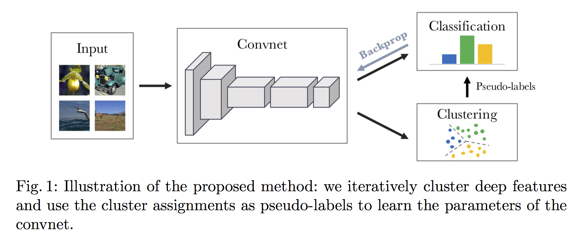
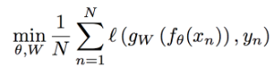
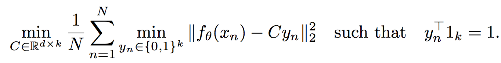
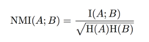
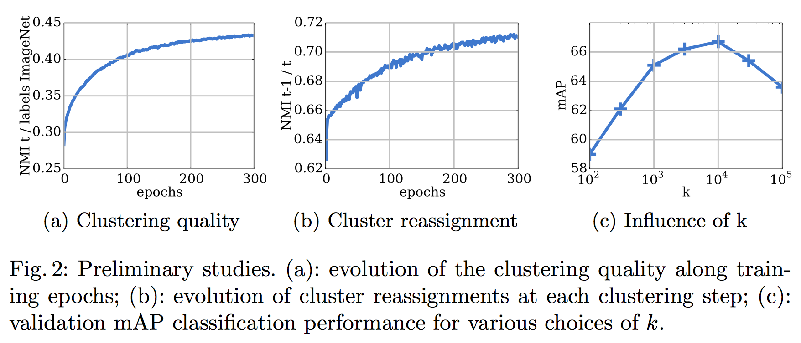

### Deep Clustering for Unsupervised Learning of Visual Features
#### Mathilde Caron et al. Facebook AI Research, 2018

#### *Contributions*
</img>

* 새로운 비지도학습 방식을 제안함 : 최소의 추가 연산을 이용해 k - means 와 같은 스탠다드한 클러스러닝 알고리즘을 이용해 end-to-end 컨볼루션 네트워크를 학습하는 구조
* 제안한 방식을 이용해 비지도 학습방식의 트랜스퍼러닝에서 최고 성능을 달성함
* 가공되지 않은 이미지 셋에서 이전 기술 대비 좋은 성능을 나타냄 (로버스트함을 보임)
* 비지도학습에서 피쳐 러닝에 대한 현재의 평가방식을 상세히 논의함

#### Related works 

* self-supervised learning :TBU

#### Architecture

* 컨볼루션 네트워크는 고차원 이미지를 저차원의 디멘션 공간의 벡터로 맵핑시키는 것에 탁월한 성능을 낸다. 
    * fθ를 이러한 맵핑 연산이라고 표시하자. θ는 이에 대응되는 파라미터 셋이다. 
    * 컨볼루션 네트워크 학습의 목적은 X = {x1, x2, ..., xn} N개의 이미지에 대해서 일반적인 목적의 피쳐를 생성하는 맵핑 함수 fθ* (θ*는 최적화된 파라미터)를 찾아내는 것이다. 
    * 생성된 피쳐를 이용해 최종 클래스를 판단하는 마지막 분류레이어를 gW로 표시하자. 
    * 학습해야할 파라미터 θ와 W를 jointly 학습시키는 것은 아래의 최적화 식으로 표현할수 있다.  
    </img> (1)

* θ가 가우시안분포에서 샘플링되었을때, 적절한 학습과정없이 fθ는 의미있는 피쳐를 생성하지 못한다. 
* 하지만 기본적인 transfer task에서는 이러한 랜덤 피쳐의 성능이 the chance level보다 더 우수한 성능을 보인다. 
    * 예를들어 랜덤 파라미터된 AlexNet는 이미지넷 데이터에 대해 12% 정확도를 보인다(the chance is at 0.1%).
* 즉 파라미터가 랜덤으로 뽑히더라도 컨볼루션 구조 자체가 인풋 시그널에 대해 아주 강한 프라이어를 전달해주기때문에 좋은 성능을 보이는 것으로 해석할수 있다.
* 본 논문의 아이디어는 이러한 약한 시그널을 컨볼루션의 판단력을 이용해 극대화시키는 것을 이용한다.

* k-menas와 같은 클러스터링은 벡터를 입력으로 받아(본 눈문에서는 컨볼루션넷의 아웃풋 fθ(xn)를 입력으로 받음) 기하학적인 기준값을 기준으로 k개의 그룹으로 클러스터링한다.
* 클러스터링에 의한 비지도학습는 아래와 같이 수식화 할 수 있다.
</img> (2)

* 클러스러닝의 아웃풋은 최적회된 (yn*)n <= N 이고, 이 assignments를 pseudo-labels로 사용한다. 
* 결론적으로 본 논문에서 제안한 DeepCluster는 (2)식을 이용해 수도-라벨을 구한 후 (1)식에 의해 수도-라벨을 잘 예측하도록 컨볼루션넷을 학습시키는 구조이다. 학습된 컨볼루션넷의 피쳐로 다시 클러스터링 후 수도라벨링을 변경하고, 변경된 수도-라벨링을 잘 예측하도록 컨볼루션넷을 업데이트하는 것으로 두 과정을 수렴할때까지 반복한다.
* 이러한 과정이 자칫 trivial solution으로 수렴할수 있으나, 이를 피하기 위해 아래와 같은 장치를 사용하였다.

___*Avoiding trivial solutions*___

* __Empty clusters__ - 첫번째 trivial solution은 모든 인풋데이터가 한개의 클러스터로 그룹핑되는 것이다. 이를 피하기 위해 임의의 클러스터에 할당된 샘플이 한개도 없을때, 랜덤하게 non-empty cluster를 선택한 후 그 중심값에서 랜덤 pertubation을 주어 빈 클러스터의 새로운 중심값을 대체한다. 업데이트된 중김값을 기준으로 다시 클러스터를 할당한다.

* __Trivial parametrization__ - 대부분의 이미지들이 매우 적은 수의 클러스터에 할당 되었을때, 컨볼루션넷은 이들을 명시적으로 구분하려고 한다. 예를 들어서 한두개의 샘플만 클러스터 하나에 한두개의 샘플만 속할 경우, 컨볼루션넷은 입력값에 상관없이 모두 동일한 아웃풋으로 예측하게 되버린다. 클래스간 불균형이 심한 분류문제에서 발생하는 문제와 동일하다. 이를 해결하기 위해 샘플의 loss function에 대한 가중치를 클러스터 사이즈의 inverse로 사용하여, 클러스터의 사이즈가 작을수록 샘플 데이터 1개가 기여하는 정도가 커지도록 하였다.

#### Experiments
* 두개의 서로 다른 assignments A와 B간의 공유되는 정보를 정량적으로 평가하기 위해 NMI 지표를 사용하였다
</img>
    * I : mutual information
    * H : entopy
    * NMI 값이 0에 까울수록 A와 B가 서로 독립적임을 의미한다. 한가지 결과로 다른 결과를 바로 예측할수 있는 경우 1값을 갖는다.
</img>

__*Relation between clusters and labels*__
* epoch에 따른 클러스터 assignment와 실제 라벨링과의 NMI지표는 Figure 2(a)와 같다. 학습 시간에 따라 실제 라벨과 클러스터 결과 간에 dependence가 증가하고, 이는 모델이 점진적으로 실제 object class와 관련한 정보를 캡쳐해 낸다는 것을 방증한다.

__*Number of reassignments between epochs*__
* 모델의 statility를 알아보기 위해 t번째 epoch에서의 클러스터와 t-1번째 epoch에서의 클러스터간의 NMI지표를 살펴보았다(Figure 2(b)). 학습이 진행될수록 NMI가 증가하는데, 이는 점점 reassignments의 수가 적어짐을 의미한다. 즉 시간에 따라 클러스터가 stabilizaing 됨을 의미한다. 하지만 0.8 정도에서 멈추는데 이는 일정 시간이 지나면 매epoch마다 일정수의 이미지가 재할당됨을 의미한다. 하지만 실제로는 이는 training에 큰 영향을 주지 않고 model은 발산하지 않는다(diverge).

__*Choosing the number of clusters*__
* 클러스터 수 (k값)가 어느정도 영향을 주는지 확인하기 위해 k값을 변경하면서 300 epoch 후 mAP 지표를 비교하였다(Figure 2(c)). 이미지넷 데이터는 본래 1000개의 클래스를 가지고 있어 k=1000에서 가장 좋은 성능을 낼것이라고 생각했으나, 실제로는 k=10000에서 베스트 퍼포먼스를 보였다. over-segmentation이 분명히 더 효과적임을 나타낸다.

