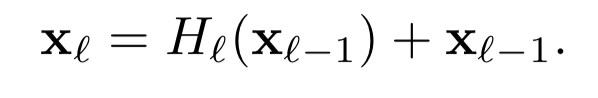
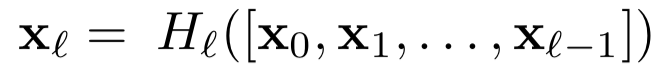
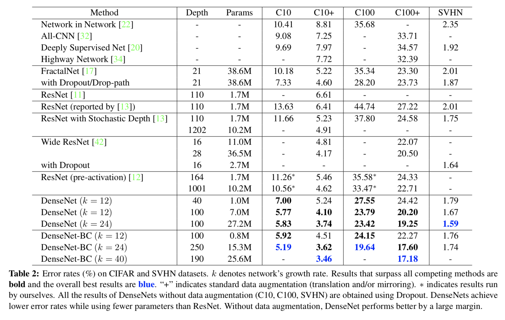

## Densely Connected Convolutional Networks
#### Gao Huang et al, implementation : https://github.com/liuzhuang13/DenseNet

### Introduction

* 5개의 레이어로 이루어진 LeNet5이 후 19개 레이어의 VGG, 최근에는 Highway나 ResNet와 같이 100개 이상의 레이어로 구성된 깊은 네트워크 구조가 등장하였다.
* 하지만 네트워크가 깊어질수록 많은 레이어를 통과하는 동안 입력 데이터가 가진 정보나 그래디언트가 사리지거나 씻겨내려가는 현상이 나타난다. 
* 이러한 현상을 해결하기 위해 최근의 연구들(ResNets, Highway Network, Stochatic Depth, Fractal Net)은 입력에 가까운 레이어와 출력에 가까운 레이어 사이의 연결을 짧게 하는 것을 핵심으로 한다. 연결이 짧으면 훨씬 더 정확하게, 더 정확하고, 효율적으로 학습 할 수 있음을 보였다.

* 이러한 인사이트를 극대화하기 위해 본 논문은 모든 레이어를 서로 연결하는 새로운 연결 패턴을 제안하였다. 모든 레이어는 이전의 모든 레이어의 피쳐맵을 인풋으로 사용하고, 레이어의 아웃풋은 이후의 모든 레이어의 인풋으로 연결된다. ResNet과 다른 점은 레이어를 통과할때 summation을 통해 피쳐를 결합하는게 아니라, concatenation하여 피쳐를 결합하는 것이다.
* 전체가 L개의 레이어로 이루어진 전통적인 CNN 구조에는 모든 레이어가 1개의 connection으로 전체 L개의 connection이지만, 제안한 구조에는 l번째 레이어는 이후 L-l개의 레이어와 모두 연결되기 때문에 전체 connection은 L(L+1)/2개가 된다. 이러한 밀집된 연결 패턴때문에 제안한 구조를 Dense Convolutinoal Network라고 이름 지었다.

* 흥미롭게도 밀집된 연결패턴은 기존보다 더 적은 수의 학습파라미터를 가진다. 마치 redundent한 피쳐맵은 다시 학습할 필요가 없는 것처럼 여기기때문이다.DenseNet은 네트워크에 추가되어야할 정보와 보존되어야할 정보를 명시적으로 구분한다. 그래서 한 레이어 당 12개의 필터로 구성되어 있어 narrow한 구조를 가지고 있고, 오직 적은 수의 피쳐맵을 네트워크의 collective knowledge에 더해주고 나머지 피쳐맵은 계속 남아 있게 된다. 마지막 분류기는 네트워크의 모든 피쳐맵에 기반해 최종 결정을 하게 된다.   
* 이 연결패턴은 학습해야할 파라미터의 효율성 뿐만 아니라, 정보와 그래디언트가 전체적으로 잘 흘러간다는 장점이 있다. 

### DenseNets

* notation :
    * x0 : a single input image
    * L : number of layers
    * Hl(.) : non-linear transformation where l indexes the layer. can be Batch Normalization, ReLU, Pooling, Conv
    * Xl : output of lth layer

* ReseNets : identity fuction으로 이전 피쳐값을 skip-connection으로 넘겨준다.
    * 이때 스킵 커넥션과 Hl의 아웃풋은 summation으로 결합된다. 이로 인해 네트워크의 인포메이션 흐름이 방해받을수 있다. 
 </img>

* <b>Dense connectivity</b> : 인포메이션 흐름을 개선하기 위해 다른 연결패턴을 제안하였다. l번째 레이어는 이전 모든 레이어의 피쳐맵을 인풋으로 연결받는다. 
 </img>

* <b>composite function</b> : Hl(.)은 3개의 연속적인 연산으로 정의된다. 
    * batch normalization (BN)
    * rectified linear unit (ReLU)
    * 3 × 3 convolution
    
* <b>Pooling layers</b> : concatenation 연산은 피쳐맵간 사이즈가 다르면 불가능하다. 따라서 위의 dense block과 별개로 transition layers를 정의하여 다운 샘플링을 효과를 더한다. 트랜지션 레이어는 배치노말리제이션 레이어와 1×1 convolution,  2×2 average pooling layer로 이루어져있다.
    * batch normalization (BN)
    * 1 × 1 convolution
    * 2 × 2 average pooling layer

* <b>Growth rate</b> : Hl 연산을 통해 k개의 피쳐맵이 만들어진다고 하면, lth레이어는 k0 + k×(l-1) 인풋 피쳐맵을 갖게 된다. (k0는 인풋 레이어의 채널수이다) DenseNet이 다른 CNN 구조와 다른 점은 예를 들면 k = 12와 같이 매우 좁은(narrow) 레이어를 가졌다는 것이다. k를 growth rate라고 부른다. 실험적으로 상대적으로 작은 growth rate로도 높은 성능을 얻을 수 있음을 확인하였다. 
    * DenseNet은 각 레이어가 이전 레이어의 모든 피쳐맵과 연결되기 때문에 네트워크의 collective knowledge(global state)에 연결된다고 할수 있다. 또한 growth rate은 각 레이어가 global state에 얼마나 많은 새로운 정보를 제공 하는지를 결정한다. 
   
* <b>Bottleneck layers</b> : growth rate를 k로 제한하긴 했지만, 여전히 레이어가 깊어질수록 인풋 수가 많아진다. 따라서 1 × 1 convolution를 bottlenect layer로 사용하였다. 보틀넥 레이어를 사용한 것이 더 효과적이라는 것을 확인하였고, 이를 DenseNet-B로 표기하겠다.
    * DenseNet-B의 Hl(.) : BN-ReLU-Conv(1×1)-BN-ReLU-Conv(3×3)
    * 1 × 1 convolution이 4k개의 피쳐맵을 생성하도록 하였다.
    
* <b>Compression</b> : compatness를 더하기 위해 transition layer에서 피쳐맵의 수를 줄였다. 만약 dense block에서 m개의 피쳐맵이 있었다면, 이후 transition layer에서 θm개의 아웃풋 피쳐맵을 만든다. 이때 θ는 0과 1사이의 값으로 θ가 1보다 작은 값(실험에서는 0.5)을 사용한 구조를 DenseNet-C로 표시하였다. 보틀넥과 트렌지션 레이어를 모두 사용한 경우 DenseNet-BC로 표시하였다.

### Experiements
 </img>

