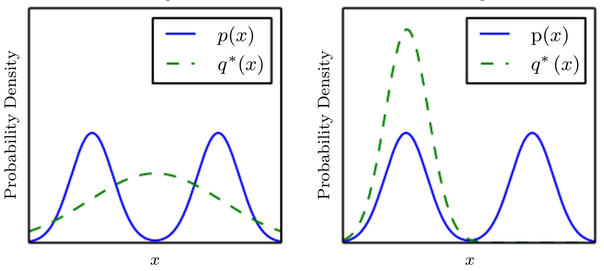
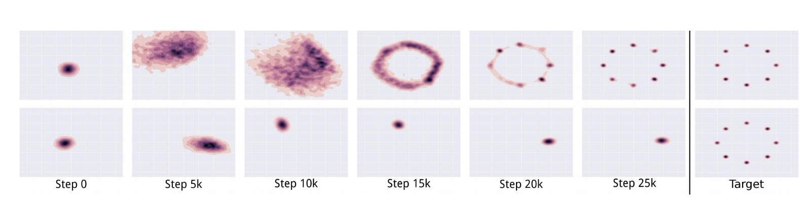
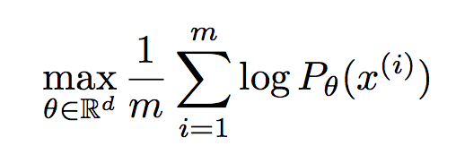
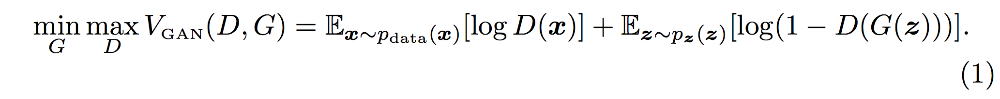
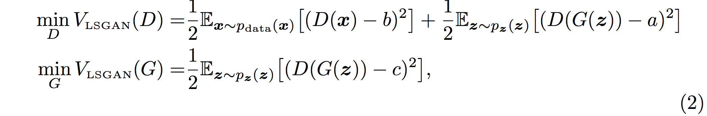
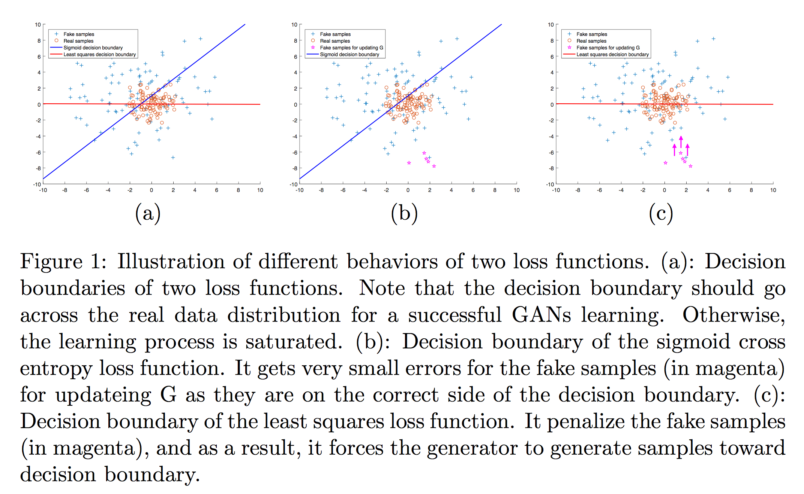
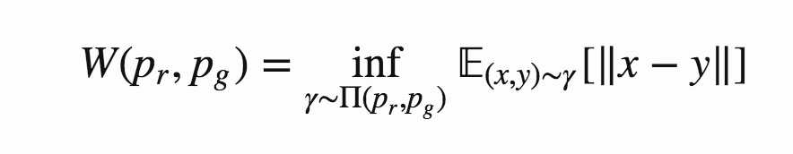
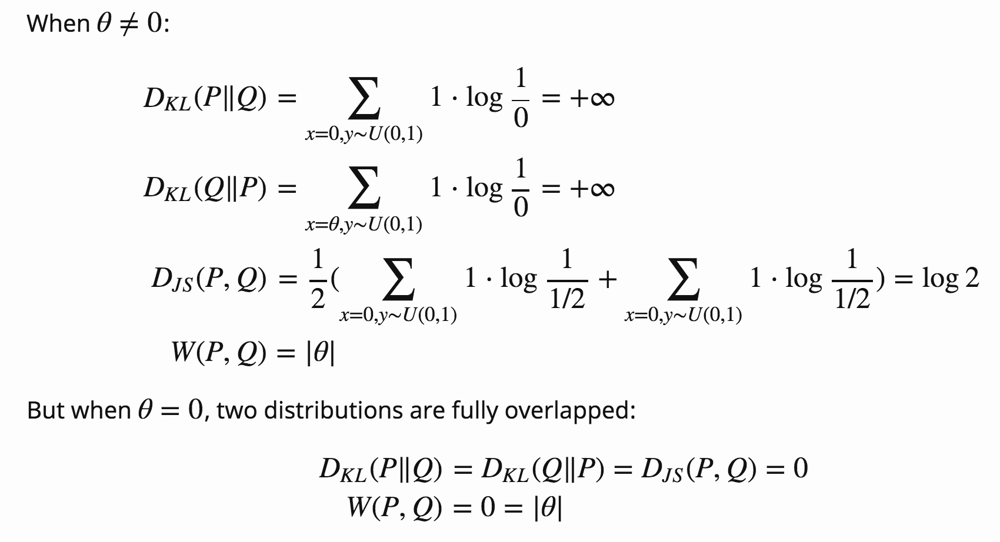

https://rosinality.github.io/2017/04/%ED%81%B4%EB%9F%AC%EC%8A%A4%ED%84%B0%EB%A7%81%EA%B3%BC-%EB%A7%A4%EB%8B%88%ED%8F%B4%EB%93%9C/
https://rosinality.github.io/2017/04/wasserstein-%EA%B1%B0%EB%A6%AC/
https://myurasov.github.io/2017/09/24/wasserstein-gan-keras.html?r#wasserstein-gan
https://lilianweng.github.io/lil-log/2017/08/20/from-GAN-to-WGAN.html#low-dimensional-supports

# Mode collapsing
* GAN의 대표적인 단점 - mode collapsing
* mode collapsing이란 우리가 학습시키려는 모형이 실제 데이터의 분포를 모두 커버하지 못하고 다양성을 잃어버리는 현상
* 손실(loss)만을 줄이려고 학습을 하기 때문에 G가 전체 데이터 분포를 찾지 못하고, 아래 그림(오른쪽)처럼 한번에 하나의 mode에만 강하게 몰리게 되는 경우
* ex. MNIST를 학습한 Generator가 특정 숫자만 생성하는 것

</img>

* 아래 그림은 학습해야할 데이터 분포가 5개의 가우시안 함수의 믹스쳐로 이루어진 경우
* 이상적으로는 윗쪽처럼 학습이 진행될수록 5개의 mode를 골고루 커버해야하는데, 아래처럼 한개의 mode에만 몰빵하는 현상(model collapsing)이 일어남

</img>

# Low dimensional supports
* generative model은 결국 데이터의 확률분포를 학습하는 것이다. 
</img>

* 전통적인 통계방식은 데이터의 분포를 parameterized model을 가정하고, 주어진 데이터의 (로그)우도값을 최대화하는 파라미터를 학습한다. 실제 데이터의 분포를 P<sub>data</sub>라 하고, 가정한 모델을 P<sub>θ</sub>라 하면 log-likelihood를 최대화하는 것은 Kullback-Leibler divergence를 최소화하는 것과 같다. 
* 하지만 KL divergence는 두 분포가 low dimensional manifold하면 infite 값을 갖는다. 그래서 일반적인 경우(고차원 데이터이지만 실제 데이터는 그보다 적은 저차원에 밀집되어 있는 형태)에 KL divergence를 최소화는 것은 적절하지 않다.

</img>
</img>

* 256 X 256 컬러 이미지를 256 X 256 X 3 차원의 이미지 공간에 있는 벡터라고 생각하면, 그러한 이미지 공간에 있는 대부분의 이미지 벡터들은 왼쪽과 같은 노이즈 이미지이다. 오른쪽과 같은 ‘유의미한’ 이미지는 사실상 이미지 공간에서 아주 작은 영역에, 혹은 선과 같은 아주 낮은 차원에 밀집되어 있을 것이다.

* vanillar GAN에는 저차원 공간에 있는 z 벡터를 고차원에 맵핑하는 generator를 설정하여 P<sub>data</sub>처럼 P<sub>θ</sub>도 low dimensional manifold한 성질을 갖게하고, D와 G가  min-max game으로 학습되게 하여 Jensen–Shannon Divergence 최소화하는 방식으로 문제를 정의하였다.

</img>

* 하지만 P<sub>data</sub>와 P<sub>θ</sub>가 둘다 low dimensional manifold하면 거의 대부분 서로 disjoint하기 때문에 Generator가 실제 데이터와 다른 이미지를 생성하더라도 Discriminator가 항상 fake와 real을 잘 구분하게 된다. 엉뚱한 시점에 학습이 종료되어 버린다.


# Least Squares Generative Adversarial Networks

#### Xudong Mao et al., 2016

* 이 논문은 vanilla GAN이 sigmoid cross entropy loss function을 사용하기 때문에 생기는 문제점을 설명하고 이를 해결하기 위해 least squared loss function 사용하는 것을 제안하였다. 

* vanilla GAN이 사용하는 loss function은 아래와 같다.

</img>

* 이 논문에서 제안하는 least squared loss function(LSGAN)은 아래와 같다.

</img>

	* a : label for fake data
	* b : label for real data
	* c : value that G want D to believe for fake data
	* 보통 0-1 binary coding sheme을 사용하여 a = 0, b = c = 1을 사용

</img>

* Figure 1은 vanilla GAN이 가지고 있는 문제점을 나타낸다. 
* (b)에서 나타나듯 sigmoid cross entropy loss function은 generator가 생성한 fake samples에 대해서 아주 작은 에러로 계산된다(decision boundary의 아래영역이라서 discriminator가 real sample로 판단한다). 따라서 G를 업데이트 할때 아무런 가르침을 주지 못한다(gradient varnishing).
* (c)는 least squared loss function의 decision boundary이다. generator가 생성한 fake samples은 decision boundary로부터 멀리 떨어져 있고, 이로 인해 패널티를 받는다. 결과적으로 generator는 패널티를 줄이기 위해 decision boundary와 가까운 fake image를 생성하는 방향으로 업데이트된다. 

* contributions
	* discriminator를 학습시키기 위해 least squares loss function을 사용하였다. LSGAN의 목적 함수를 최소화하는 것은 Pearson χ<sup>2</sup> divergence를 최소화하는 것과 같음을 보였다. LSGAN과 vanilla GAN을 비교하는 실험 결과, LSGAN이 더 우수한 성능을 보였다. 
	* LSGAN의 두 가지 구조를 설계하였다. 첫번째는 112 x 112 이미지 생성을 위한 것으로 여러 종류의 scene datasets에 대해서 우수한 성능을 보였다. 두번째는 수 많은 클래스가 존재하는 문제를 위한 것으로 3470개의 클래스가 있는 handwritten Chinese charactor dataset으로 평가한 결과, LSGAN이 현실적인 수준의 문자 이미지를 생성하는 것을 확인하였다. 

```python
# 생략..
z = Input(shape=(self.latent_dim,))
img = generator(z)
discriminator.trainable = False
valid = discriminator(img)
combined_model = Model(z, valid)
# (!!!) Optimize w.r.t. MSE loss instead of crossentropy
combined_model.compile(loss='mse', optimizer=optimizer)
```


# Wasserstein GAN

#### Martin Arjovsky et al., 2017

* Ian Goodfellow et al.에 의하면 vanilla GAN의 목적 함수는 JS divergence를 최소화하는 것과 같다. 이 논문은 low dimensional manifold로 인해 JS divergence가 수렴하지 않을 수 있음에 문제를 제기하고, 이를 해결하기 위해 Wasserstein distance에 기반한 GAN 학습을 제안하였다. 

* Wasserstein distance는 Earth mover's distance(EM distance)라고도 한다. "어떤 분포를 따르는 흙덩이를 다른 분포를 따르게 하려면 최소 어느정도의 삽질이 필요한가"로 해석할수 있다. 
	* 예를 들어, 아래와 같은 P와 Q 분포를 생각해보자.
		P<sub>1</sub> = 3, P<sub>2</sub> = 2, P<sub>3</sub> = 1, P<sub>4</sub> = 4
		Q<sub>1</sub> = 3, Q<sub>2</sub> = 2, Q<sub>3</sub> = 1, Q<sub>4</sub> = 4
	* P<sub>i</sub>를 Q<sub>i</sub>처럼 만들기 위해 옮겨야하는 흙덩이를 δ<sub>i</sub>로 나타내면, δ<sub>i+1</sub> = δ<sub>i</sub> + P<sub>i</sub> - Q<sub>i</sub>와 같다.
	* 예시의 경우, 최종 EM distance는 W = sum of |δ<sub>i</sub>| = 5가 된다.

</img>

* 연속적인 확률 분포에서는 아래와 같이 정의된다. inf는 infimum을 나타내는 것으로 greatest lower bound를 의미하여 최소값을 나타낸다.

</img>
</img>

* 왜 Wasserstein distance가 JS나 KL divergence보다 좋을까? 아래 처럼 2차원 공간에서 수직선 모양의 P분포(학습해야하는 분포)와 이를 학습하기 위해 parameter θ를 이용해 모델링한 Q분포를 생각해보자. 두 분포 사이의 거리는 아래처럼..

</img>

</img>

* KL distance는 두 분포가 떨어져있을때 infity이고,  JS distnace는 θ가 0일때 갑자기 점프한다. 반면 Wasserstein distance는 더 smooth measure를 제공하고 이는 gradient descents를 이용해 θ를 학습할때 더 안정적인 학습이 가능한다.


