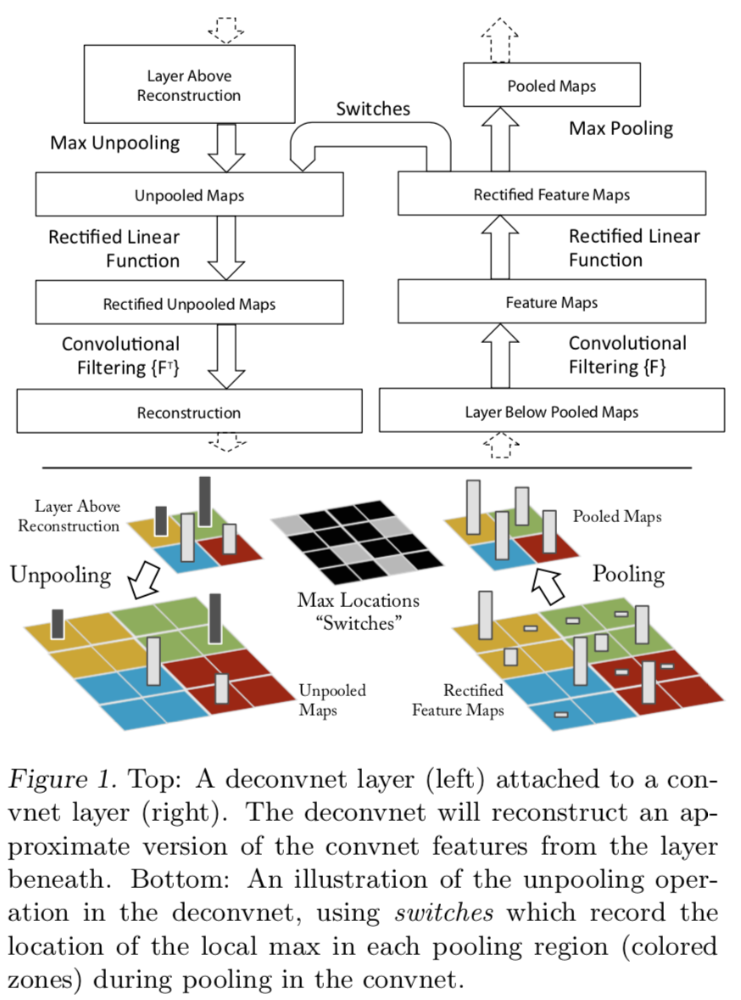
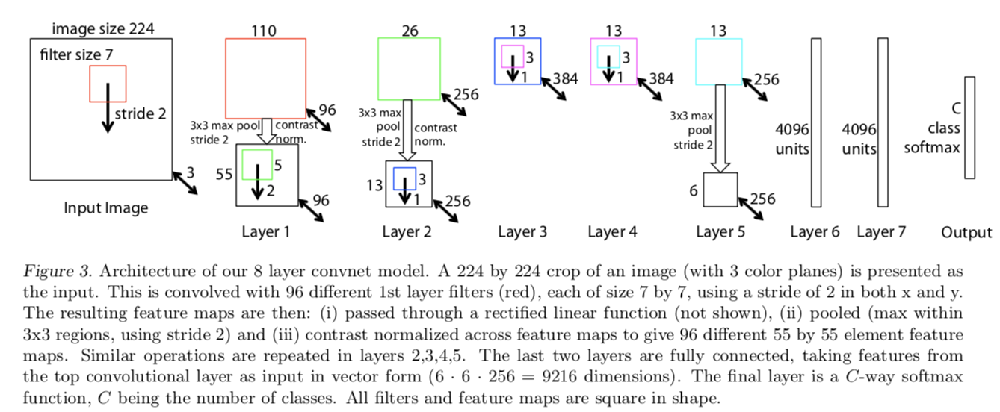
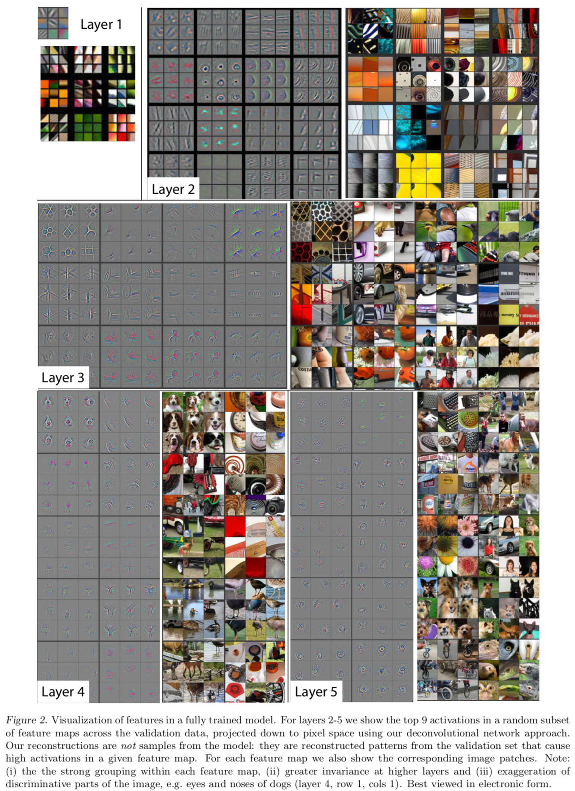
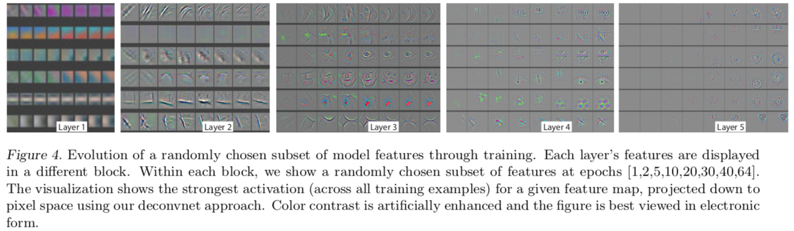
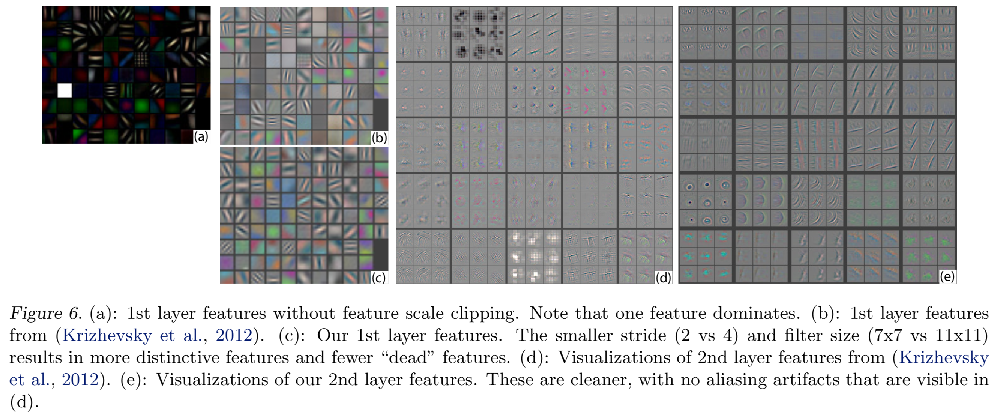
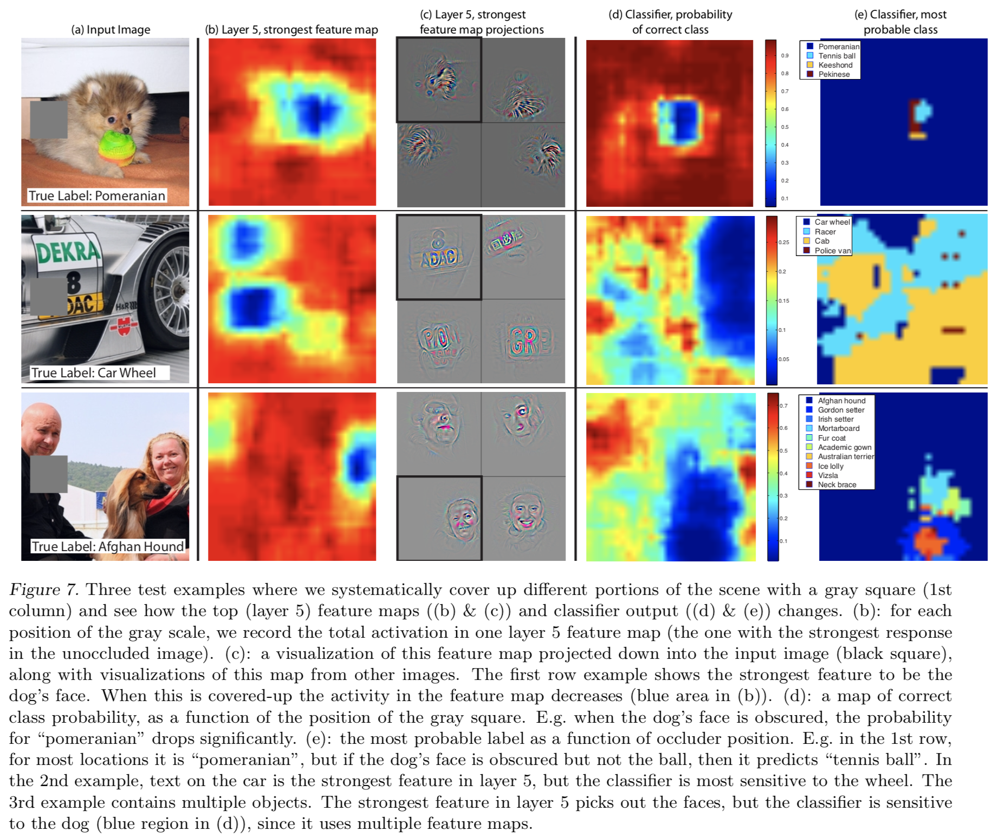

# Visualizing and Understanding Convolutional Networks

#### Matthew D. Zeiler, Rob Fergus, 2013

### Introdution
* 1990년대 LeCun et al.(LeNet5)이후 컨볼루션 네트워크는 아주 우수한 성능을 내며 발전해왔다. 
* 눈부신 발전에도 불구하고 CNN의 내부 오퍼레이션에 의한 엑티베이션의 변화양상, 그리고 어떻게 좋은 성능 얻게 되었는지에 대한 연구는 거의 없었다. 
* 이 논문은 Deconvolutional Network(deconvnet)라는 시각화 기법을 사용하여 입력의 각 픽셀들이 피쳐맵에 어떻게 투영되는지(project) 알아보았다.
* 또한 입력 이미지의 일부분을 가려보고 이것이 아웃풋에 어느정도 영향을 주고, 이미지의 어떤 부분이 최종 분류 판단에 가장 중요한지 알아보기 위해 민감도 분석을 실시하였다.

* 관련 연구로는 Le et al. 2010 에서는 레이어를 통해도 불변하지 않는 정보(invariance)를 알아보고자 최적값을 비롯한 주변의 값들의 헤시안이 어떻게 계산되는지 알아보였다. 하지만 레이어가 깊어질수록 불편하지 않는 정보는 점점 복잡해져 단순히 quadratic approximation으로는 추정하기 어렵다는 한계가 있었다. 
* 또한 Donahue et al. 2013 에서는 레이어의 엑티베이션값에 큰 영역에 대해서 이에 대응되는 입력이미지의 patches를 시각화하였다. 
* 기존 연구들과 다른 게 이 논문은 non-parametric 관점에서 입력이미지의 일부분이 아니라 특정 피쳐맵이 만들어지는 구조를 알아보기 위해 top-down projection 과정을 제안하였다. 

### Approach
* 이 논문은 스탠다드한 convnet으로 Alexnet(Krizhevshy et al. 2012)을 사용하다. 컨볼루션 레이어와 relu, max pooling으로 이루어진 네트워크로 자세한 내용은 해당 논문을 참고하기 바란다. 

#### Visualization with a Deconvnet
* 각 레이어의 엑티베이션을 입력이미지의 픽셀로 맵핑시키기 위해 이전 논문에서(Zeiler et al. 2011) 비지도 학습 방식으로 제안한 Deconvolutional Network 방식을 변형하여 사용하였다. 이는 convnet의 모든 컨볼루션 레이어마다 대응되는 deconvent을 수행하는 방식이다. 
* 입력 이미지와 각 레이어의 피쳐맵들을 그대로 사용한다. 특정 피쳐맵의 엑티베이션을 알아보기 위해 나머지 다른 피쳐맵은 zero로 셋팅하고, 그 피쳐맵을 인풋으로 deconvnet 연산을 한다. 
* deconvent은 (1)unpool, (2) rectify, (3) fillter to reconstruct the activity로 이루어지며, 이 과정을 인풋 픽셀에 닿을때까지 반복한다.

</img>

* __Unpooling__ : convnet에서 max pooling은 non-invertible(복원불가능한) 연산이다. 가장 큰 엑티베이션 값을 제외하고는 모두 사라지기 때문이다. 하지만 각 풀링 영역에서 가장 큰 값의 위치를 래코딩함으로서 추정가능하도록 하였다. switch라는 변수를 사용하여 적절한 위치에 복원된 엑티베이션값이 나타나도록 하였다. (Fig.1의 아래그림을 참조)

* __Rectification__ : relu의 inverse reconstruction으로 relu를 동일하게 사용하였다. relu를 통해 0으로 activation된 값은 음수에 해당하는데 이는 복원불가능함으로 그대로 0으로 두고, 양수값은 그대로 사용한다.

* __Filtering__ : convnet의 filter들의 transposed filters를 사용하였다. 

* 이 과정을 통해 다시 복원된 결과는 원래의 인풋 이미지의 일부와 유사할 것이고, 이를 통해 인풋 이미지의 어떤 부분이 분류에 결정적이었는지 유추할수 있다. 

### Training Details : 
</img>

* Alexnet(Krizhevshy et al. 2012)과 다른 점은 layer 3,4,5에 사용한 sparse connection을 dense connection으로 바꾸었다는 것과 layer1, 2에 필터 사이즈 7, 스트라이드 2를 사용하였다는 것이다. 이러한 변경의 이유는 deconvnet을 이용해 분석한 결과를 반영한 것으로 아래에서 다시 설명하도록 하겠다. (Alextnet은 11x11 필터사이즈와 스트라이드4를 사용)
    * training set : ImageNet 2012
    * data augmentation : 10 different sub-crops of size 224x224
    * Stochastic gradient descent
    * batch size : 128
    * learning rate : start with 10-2, momentum term of 0.9
    * Dropout probability : 0.5
    * weight intialize : 10-2, biase : 0

### Convnet Visualization
* __Feature Visualizatin__ : 
</img>

    * 일부데이터에 대해서 엑티베이션이 가장 강한 9개를 랜덤으로 뽑아 시각화한 결과는 Fig2와 같다. 
    * 레이어2는 edge/color에 대응되며, 레이어3는 texture와 같은 더 복잡한 정보를 잡아내고, 레이어4는 클래스에 특화된 더 유의미한 정보를 나타낸다. 또한 레이어5는 물체의 전체적 정보를 통해 분류에 유의미한 정보를 표현하는 것으로 보인다. 즉 네트워크가 hierarchical nature를 가짐을 보여준다.

* __Feature Evolution during Training__ :
</img>

    * Fig4는 각 레이어의 피쳐맵들이 epoch에 따라 변하는 모습을 나타냈다.
    * 입력과 가까운 레이어는 수번의 epoch만에 수렴했지만, 레이어가 깊어질수록 40-50 epoch이 지나야 의미있는 정보를 나타내기 시작했다.

* __Feature Invariance__ :
</img>

    * Fig5는 입력이미지를 다양한 각도로 5 개의 이미지 샘플을 변환, 회전 및 크기 조정한 결과이다. 
    * 대체적으로 네트워크의 결과값은 회전 변환에 대해 안정적이고, 회전 대칭 (예 : 오락 센터)이 있는 물체가 이미지에 포함되지 않는 한 네트워크의 아웃풋은 회전변환에 의해 변할수 있다. 

#### Architecture Selection
</img>

* 학습된 convnet을 시각화함으로써 더 좋은 모델 구조를 알아낼수도 있다. 기존 Alexnet의 첫번째와 두번째 레이어를 시각화한 결과 Fig6에서 나타나듯 여러가지 문제점들이 표시됐다. 
* 첫 번째 레이어 필터는 중간 주파수를 거의 포함하지 않고 극도의 높은 주파수와 낮은 주파수의 정보가 혼합되어 있고, 두 번째 레이어는 스트라이드가 너무 커서 의미없는 정보가 표시되는 것을 볼수 있다.
* 이러한 현상을 막기 위해 필터사이즈와 스트라이드를 줄인 새로운 구조를 이용해 학습하였고, 그 결과 모델 정확도를 더 올릴 수 있었다. (Table 2 결과 참고)

#### Occlusion Sensitivity
</img>

* 모델이 이미지에서 객체의 위치를 ​​실제로 식별하는지 또는 둘러싸는 컨텍스트를 사용하는지 것인지 확인하기 위해 이미지의 일부를 가린 데이터를 입력으로 사용해보았다.
* 그 결과 배경이 아닌 물체가 가려진 경우, 네트워크의 아웃풋 확률이 현저히 떨어지는 것으로 나타났다. 이는 모델이 이미지 내의 객체를 인식하여 분류하고 있음을 명확하게 보여준다.