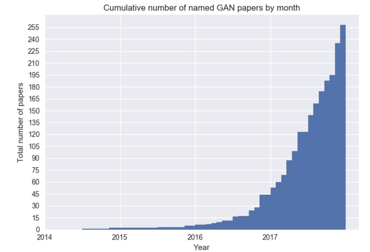
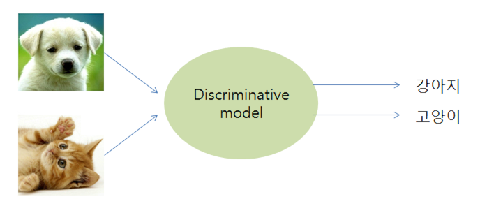
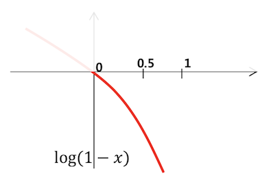

# Generative Adversarial Nets

이 포스팅은 Unsupervised learning 중 generative adversarial network(GAN)에 대해서 설명하는 포스트입니다.

겐 또는 간이라고 불리며, 2014년 Ian Goodfellow가 처음 제안한 방법론으로 최근 기하급수적으로 연구되고 있는 모델이다.
</img>

GAN에 대해서 말하기전에 먼저 머신러닝관점에서 GAN과 같은 generative model이 어떤 식으로 데이터를 학습하는 것인지 이야기해보자

### 머신러닝 모델은 학습방식에 따라 크게 지도학습(supervised learning)과 비지도학습(unsupervised learning)으로 나뉜다. 
(최근 활발히 연구되는 강화학습은 따로 분류하겠다)

</img>

지도학습은 분석자가 데이터를 분석하여 어떤 상태에서는 어떤 결과가 나온다는 것을 기계에게 일일히 지도하여 학습하는 방법이다. 학습 후 기계에게 특정 상황에서 어떤 결과가 나올지 물어보면, 기계는 학습한 경험을 바탕으로 나름대로 추론한 결과를 제시한다. 예를 들어 개와 고양이 사진을 주고 A는 개사진이고, B는 고양이사진이라고 결과값을 지정하여 기계에게 학습시키면, 다음에 어떤 사진 C가 개인지 고양이인지 분류하는 작업을 수행할수 있다.

</img>

반면 비지도학습은 기계에게 데이터만 주어주고, 기계가 알아서 데이터의 숨겨진 구조와 패턴을 파악하도록 하는 것이다. 아무 결과값도 주어지지 않기때문에 기계가 알아서 숨겨진 패턴을 파악하도록 하는 학습법이다. 

</img>

비지도학습 중에서 generative model은 주어진 데이터의 분포를 학습하여 학습한 데이터와 비슷하게 새로운 데이터를 생성하는 모델이다. 이때 입력값(laten vector, z)은 잠재공간속의 임의의 값이다. 누구가에게 고양이 그림을 그리도록 시킨다고 해보자. 어제 그린 고양이 그림과 오늘 그린 고양이 그림이 같을까? 아마도 다를것이다. 그림을 그릴때의 기분이나 그림을 그릴때 쓴 도구들이 달라질수 있기 때문이다. 이처럼 어떤 데이터를 생성할때는 외부요인 혹은 random한 요소가 포함되는데, 이를 latent vector로 생각할수 있다. 추후 이야기하겠지만, latent vector를 잘 manipulate할수 있다면 우리는 원하는 형태의 데이터를 얻을 수 있을것이다. 

### 데이터의 분포를 학습한다는 것은 무슨 의미일까?
동전 던지기를 생각해보자. 누군가에게 100번 동전을 던지 결과를 보여주고 다음번에 동전을 던지면 어떤 결과가 나올지 대답해보라고 한다. 아마도 그 사람은 앞이 나올 확률과 뒤가 나올 확를 계산하여 확률이 더 큰 쪽으로 대답할 것이다. 데이터의 분포를 학습한다는 것도 앞이 나올 확률, 뒤가 나올 확률, 즉 모든 경우에 수에 대해서 확률값을 계산한다는 의미이다. 

</img>

개와 고양이 이미지를 섞어 genertive model을 학습시킬 경우도 마찬가지이다. 아래 그림은 1차원 확률분포로 그렸지만 실제로는 고차원 공간에서 확률분포를 상상하자. 만약 학습데이터에 개 사진이 많았다면 개사진 근처의 확률값이 높을 것이고, 고걍이 사진이 많았다면 고양이 사진 근처의 확률값이 높을 것이다.

</img>

### 대체 데이터의 분포를 학습하면 뭐가 좋다는 걸까? 
개 사진을 보고 개라고 분류하는 것과 도화지에 개를 그리는 것 중 어느 것이 더 쉬울까?
개와 고양이 사진을 분류하는 모델과 개 그림을 그릴줄 아는 모델 중 어느것이 더 똑똑하다고 할수 있을까?
아마도 대부분의 사람들은 분류모델보다는 그림을 그릴수 있는 모델이 개와 고양이에 대해서 더 잘 이해하고 있다고 생각할 것이다. 
데이터를 잘 이해하고 있다면, 분류하는 문제는 매우 쉬울 수 있다. 

CNN기반의 딥러닝 분류모델은 filter(혹은 kernel)이라 불리우는 레이어를 통해서 입력데이터의 부분조각들의 특징을 추출해 분류하는 방식이다. 작은 셀로판지 조각들로 입력데이터의 일부분들을 바라보고 단계적으로 특징들(feature map)을 뽑아낸다. 

반면 generative model은 모든 경우(latent vector, z)에 대해 결과값(generated value)를 맵핑시키는 분포를 학습한 것이기 때문에 개의 공통된 특징은 물론 진돗개와 슈나우저의 차이까지 학습되도록 한다. 잘 훈련된 모델을 얻긴 어렵겠지만, 일단 훈련시키면 개와 고양이를 구분하는 것은 더 잘할수 있겠다. 

### generative model의 종류
데이터의 분포를 추정하는 모델은 GAN 이외에 여러가지 방식이 이미 존재하지만, GAN이 가장 많은 관심을 받고 있다는 것을 부정하는 사람은 거의 없을 것이다. 

</img>

### GAN의 기본 아이디어
이제까지 Generative adversarial network 중 첫번째 단어 generatvie의 의미를 살펴보았다. 그리고 마지막 단어 network는 다른 딥러닝 모델들이 그러하듯이 neural network구조를 의미하는 것이니 깊이 다루지 않고, 모델의 핵심이라고 할수 있는 adversarial의 의미를 알아보자.

일단 우리의 목적을 다시 상기시켜보면, 우리는 입력데이터를 잘 이해하고 있는(데이터의 분포를 알고 있어, 이 분포에서 새로운 샘플을 뽑아낼수 있는) 모델(generator)를 얻고 싶다. 이 목적을 달성하기 위해 Goodfellow는 게임이론을 이용했다. generator가 다른 모델과 서로 경쟁하는 상황을 만들고, 서로를 속이거나 이기기 위해 노력하는 과정을 통해 잘 훈련된 generator를 얻을 수 있다는 것이다. 

GAN의 구조에서 서로 경쟁하는 것은 generator와 discriminator이다. discriminator는 입력데이터에서 뽑은 샘플과 generator가 생성한 샘플을 구별하는 것을 목적으로 한다. discriminator의 학습은 어떤 데이터가 들어오면, 이 데이터가 입력데이터에서 뽑은 진짜 데이터일 경우에는 1과 가까운 값을 출력하도록 하고 generator가 생성한 가짜 데이터일 경우에는 0과 가까운 값을 출력하도록 한다. 반면 generator는 최대한 입력데이터와 유사하게 가짜 데이터를 만들어내는 것을 목적으로 한다. 즉 discriminator를 속이기 위한 방향으로 학습이 된다. 

</img>
</img>

이 구도를 설명하기 위해 Ian이 논문에서 실제로 사용한 비유는 화폐위조범(generator)과 경찰(discriminator)이다. 
경찰은 진짜 돈(sample from input data)과 가짜 돈(generated sample from generator)을 구별하는 역할을 하고, 화폐위조범은 경찰을 속이기 위해 최대한 진짜같은 돈을 위조하는 것을 목표로 한다. 

학습이 되기 전에는 경찰은 위조화폐를 식별하는 능력이 없고, 위조범도 진짜 화폐를 모사할수 있는 능력이 없을 것이다. 하지만 경찰이 한번 위조화폐를 구별해내면, 위조범은 학습을 통해 경찰을 속이기 위해 위조 능력이 올라가게 되고, 경찰도 학습을 통해 식별하는 능력이 더 올라가고.. 시간이 흐를수록 위조범의 모사능력이 높아질 것이다. 

### GAN - objective

</img>
</img>
</img>
