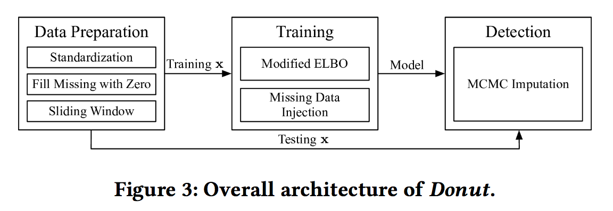
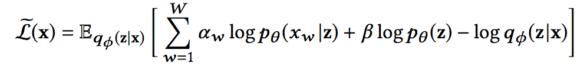
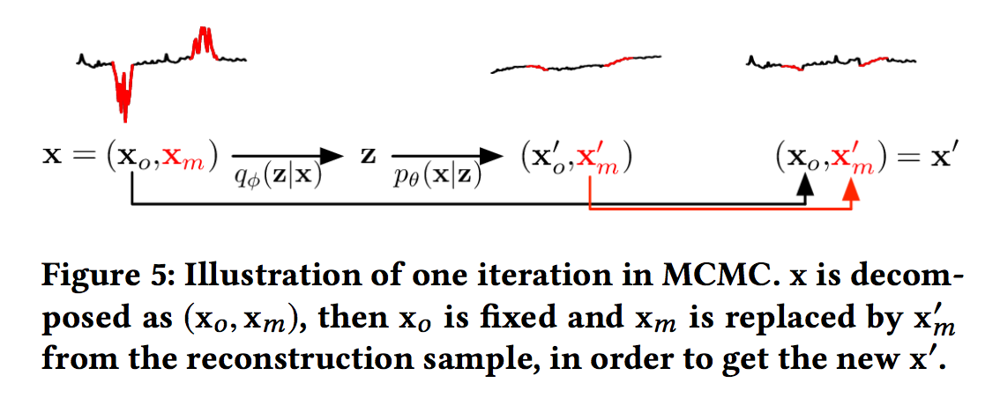

### Anomaly detection based on VAE

#### Unsupervised Anomaly Detection via Variational Auto-Encoder for Seasonal KPIs in Web Applications, 2018, Haowen Xu et al.

#### implementation - https://github.com/haowen-xu/donut

#### __contributions__

* proposed "Donut" : VAE + three technique - Modified ELBO, Missing Data Injection in training,MCMC imputation in detection
* Training on both normal and abnormal data
* novel KDE interpretation

</img>

</img>

*__Architecture__*

</img>

* 일반적인 VAE와 비슷한 network 구조이나 σ값 계산 시 Soft Plus 활성홤수를 사용하였다는 점이 차별점이다.

* 보통 VAE 구조에서는 variance로 바로 구하지 않고, log_variance를 구함으로써 linear activation output이 음수더라도 variance가 양수값을 의미하도록 한다.

* 하지만 본 논문에서는 입력데이터의 특성이 거의 0에 가까운 아주 작은 variance를 가지기때문에 log variance의 값이 unbounded 되어 가우시안 변수의 likelihood를 계산할때 수치적인 문제가 발생한다. 이러한 문제를 방지하고자 soft plus activation과 ε 트릭을 사용하였다. 

* (참고 : soft plus activation = https://sefiks.com/2017/08/11/softplus-as-a-neural-networks-activation-function/

* 또한 전체 아키텍처 구조를 간단히 하고, 해석의 용이성을 위해서 fully connected layers를 의도적으로 사용하였다. 

#### __Training__ 

* Unsupervised learning 기반의 anomaly detection의 철학은 normal pattern을 학습하고, 학습한 normal pattern과 얼마나 떨어져있는가를 기준으로 디텍션을 한다.

* 따라서 abnormal pattern이 학습되는 것을 최대한 피해야하는데, 본 논문의 문제 시나리오(웹서비스의 KPI 지표 모니터링)는 시스템 오퍼레이터가 abnomal이라고 라벨링한 데이터가 존재함으로 이를 최대한 반영하고자 하였다.

* 결론적으로 입력데이터에 none값(missing value)는 0으로 채우고, ELBO를 계산할때 missing value나 오퍼레이터가 anomalies라고 표시한 값들은 포함되지 않도록 하였다. 

__제안한 Modified ELBO__

</img>

αw : indicator, 1- normal point , 0 - abnormal point

β :  normal point ratio, sum of αw / W

* 또한 실험적으로 데이터의 일부분을(랜덤하게 λ ratio만큼) 0값으로 치환하여(마치 missing value처럼) 모델을 학습했더니 normal points를 더 잘 복원하여 M-ELBO 효과가 더 증폭되는 것을 확인하였다. → Missing Data Injection technique

#### __Detection__

* 학습된 VAE를 이용해서 anomaly detection하는 과정은 reconstruction probability(입력데이터와 decoder로 복원된 데이터간의 cross-entropy)를 계산하는 것으로 요약된다. 

* detection과정에서는 missing value를 0값으로 치환하는 것은 z를 맵펭할때 잘못된 bias를 줄수 있다. 따라서 detection과정에서는 MCMC-based missing data imputation technique를 사용한다.

__MCMC-based missing data imputation__

</img>

* 테스트하는 데이터 X가 관측값 Xo과 결측값 Xm으로 구성되어 있다고 하면, VAE의 encoder를 이용해 첫번째 잠재벡터 z를 얻을수 있다. z에 맵핑되는 복원된 데이터를 (X'o, X'm)으로 표현한다. 이때 원래 입력데이터 (Xo, Xm) 중에 결측값 Xm만 X'm로 치환한다. 치환된 데이터 x' = (Xo, X'm)를 이용해 다시 z값을 얻고, 복원데이터 중 X'm를 이용해 입력 데이터를 다시 업데이트한다. 이러한 과정을 M iteration 반복하여 최종 x' = (Xo, X'm)를 얻을 수 있다. 

* MCMC 이후, 확률변수 z의 L개의 샘플을 얻고 reconstruction probability를 계산한다. 

* 입력데이터의 모든 포인트(Xt-n+1, Xt-n, ... ..., Xt)에 대응되는 reconstruction prob.을 구할수 있지만, 여기는 가장 마지막 포인트(Xt)에 해당하는 값을 스코어로 사용한다.  

#### __Experiment setting__

* sliding window size : 120
* latent dimension : 3 for B,C dataset, 8 for A dataset
* ε of std layer : 10-4
* injection ratio λ : 0.01
* MCMC iteration count M : 10
* Monte Carlo interation L : 1024
* batch size : 256
* epochs : 250
* adam optimizer with an initial learning rate of 10−3
* discount the learning rate by 0.75 after every 10 epochs
* L2 regularization with a coe cient of 10−3
* clip the gradients by norm, with a limit of 10.0

#### __Effects of Donut Techniques__

</img>

* M-ELBO contributes most of the improvement over the VAE baseline.

* 모델이 abnormal point의 가능성에 익숙해지도록 하여, abnormal point의 가능성까지 고려하면서 원하는 결과를 생상하도록 한 것으로 해석된다

* 보통 normal data만 이용하여 모델을 학습하는데, 오히려 학습데이터에 abnormal data를 집어넣는게 더 효과를 줄수 있음을 보였다

* 랜덤하게 Missing value를 넣어줌으로써 이러한 효과를 더 증가시킬수 있다.

* detection 단계에서 MCMC는 비정상 포인트가 많이 포함될수록 이에 대응하는 정상패턴을 잘 복원하지 못한다는 한계가 있다. 

* 논문의 시나리오는 시스템 운영자가 초기 비정상 포인트가 감지되는 최초 시점(비정상 포인트의 비율이 전체 윈도우의 절반을 넘지 않음)을 잘 찾아내는 것에 중점을 두고 있어 해당문제점은 깊게 고려하지 않았다.

__참고 :__
* Kernel Density Estimation 관점에서 해석하면 
* This procedure is very similar to weighted kernel density estimation.
* We thus carry out the KDE interpretation: the reconstruction probability Eq(z|x)[log p(x|z)] in Donut can be seen as weighted kernel density estimation, with q (z|x) as weights and log p(x|z) as kernels.

