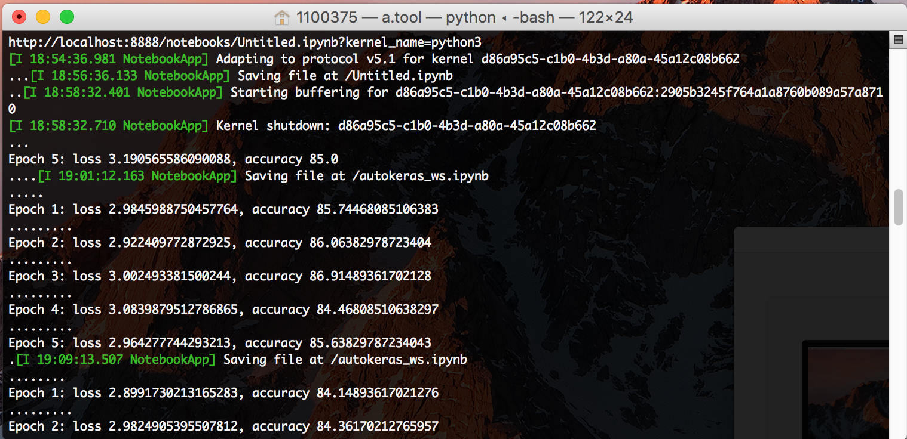
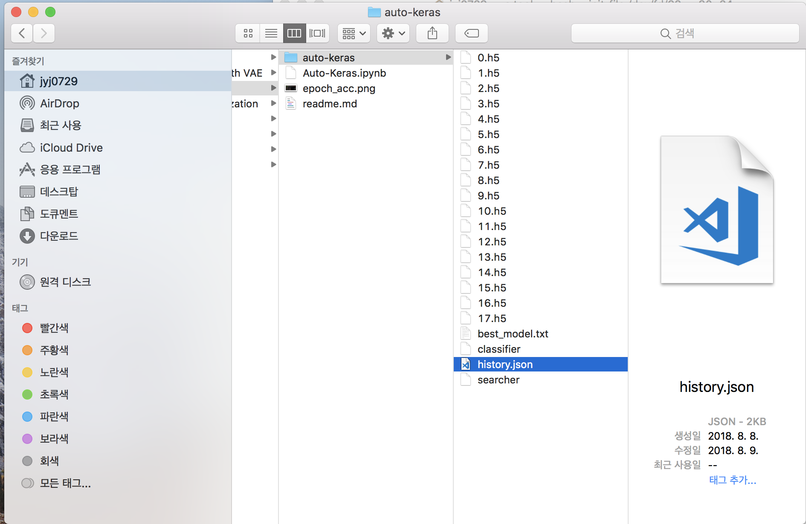

# Auto-keras 이용하기

데이터에 적합한 모델을 자동으로 찾아준다는 오토ML 패키지가 나왔다고 하여 사용 후기를 공유합니다.

수정된 내용으로 다시 공유해주시는 것은 언제나 환영입니다. *출처만 표시해주세요*

참고자료 : 허민석님의 https://youtu.be/EDGLf8eCK04
* __*공식 문서 : https://autokeras.com/ *__
* __*깃허브 : https://github.com/jhfjhfj1/autokeras *__

### Auto-keras란?
* Auto-Keras는 자동화된 기계 학습 (AutoML)을 위한 오픈 소스 소프트웨어 라이브러리입니다.
* AutoML의 목표는 데이터 과학 또는 기계 학습에 대한 전문적인 배경지식없이 도메인 전문가가 손쉽게 딥러닝 모델을 학습할수 있도록 하는 것입니다.
* Auto-Keras는 __*딥러닝모델의 아키텍처 및 하이퍼 파라미터를 자동으로 검색하는 기능*__ 을 제공합니다.

### 주요 내용은 아래와 같습니다.

0. 설치하기
1. 데이터 불러오기
2. classifer 정의와 학습
3. clf의 final_fit  // 여기까지는 기본 공식문서의 예제와 동일합니다.
4. 저장된 clf, searcher 다시 불러오기
5. graph 다시 불러온 후 torch 또는 keras 모델로 변환하기
6. keras model 다시 학습시키기

### Summary

* torch 기반 패키지입니다. 
    * 코드를 살펴보니 현재는 벤치마크 데이터셋을 불러오는 부분에서만 keras를 사용하고 있습니다.
    * searcher가 탐색하는 부분은 torch 기반으로 작성되어 있습니다.
    * pypi(pip install auto-keras)를 통해 설치한 경우, 토치 모델로만 변환 가능합니다.
    * github를 통해 설치한 경우, keras 모델로도 변환가능합니다. 

* 모델 탐색 결과를 저장하고, 다시 불러오고, 구조를 변경하여 학습할 수 있음을 확인하였습니다.
    * 주어진 데이터에 대해서 베이스 모델을 손쉽게 찾을 수 있습니다. 이를 기반으로 새로운 구조로 튜닝할수 있습니다.
    * 아직까진 분류 문제에 대해서 가능하네요.

* 딥러닝 전문가가 모델을 학습하는 것보다 더 좋은 성능의 모델을 찾아낼수 있을까요? 
    * 충분한 capacity(그러니까 GPU 장비와 탐색 시간)가 주어져야할 것같아요. 
    * 제 맥북에서 12시간동안 탐색한 결과는 총 18개의 alternative models를 찾았고, best model 모델 구조로 0.7437 까지 올라가는 것을 확인했습니다. (1 epoch 0.6326, after 5 epoch 0.7437)

    
# 0. 설치

* pip install auto-keras 또는 
* pip install git+https://github.com/jhfjhfj1/autokeras.git

    * 아직은 python 3.6버전만 가능합니다.
    * 저는 케라스 모델로 변환하는 메소드를 이용하기 위해 깃허브에서 설치하는 방법을 사용하였습니다.
   

# 1. 데이터 불러오기

* keras 패키지를 이용해 잘 알려진 벤치마크 데이터를 가지고 있거나, 개인이 가지고 있는 데이터를 이용할수 있습니다.
* 저는 cifar10 데이터를 이용했습니다. 
* cifar10에 대한 주요 딥러닝 모델별 결과는 여기를 참고하세요.
    * https://en.wikipedia.org/wiki/CIFAR-10
    * DenseNet Error rate: 5.19 %, Wide ResNet Error rate: 4.0 %


```python
from keras.datasets import cifar10
from autokeras.classifier import ImageClassifier

(x_train, y_train), (x_test, y_test) = cifar10.load_data()

```

    Using TensorFlow backend.


# 2. classifer 정의와 학습

* 오토-케라스를 구성하는 요소는 아래와 같습니다.
    * 여러개의 분류기 모델이 있는 탐색 공간. 입력데이터에 의해 정의됨 : classifier
    * 이데아 공간을 탐색하고 최적 모델 구조를 찾아가는 옵티마이저 역할 : searcher
    * 이데아 공간의 한 포인트에 대응되는 임의의 모델 구조 : graph
    * 고정된 graph를 가지고 입력데이터에 적합하게 파라미터를 학습하는 실제 분류 모델 : model

* 첫번째 할일은 우선 우리가 산책해야할 공간을 정의하는 것입니다. ImageClassifier를 정의합니다. 
* 그리고 clf.fit()을 하면, 탐색 공간에서 최적 graph을 찾도록 searcher가 clf 공간을 탐색합니다.
* searcher가 탐색하는 과정은 아래와 같습니다.
    * 공간 내 한 포인트에 대응되는 그래프를 그리고, 그 그래프로 모델 파라미터를 학습시킵니다. 
    * 이때 모델을 얼마나 학습시킬지, 얼마나 학습시켜보고 이 그래프를 평가할지를 결정할수 있습니다. 
        * default 값은 아래와 같습니다. 
            * MAX_ITER_NUM = 200
            * MIN_LOSS_DEC = 1e-4
            * MAX_NO_IMPROVEMENT_NUM = 5
    * 저는 cpu만 있는 맥북에서 테스트를 하기때문에 각 그래프별로 5 epoch만 학습하도록 하였습니다. 
        * epoch별 정확도는 주피터 노트북에 출력되지 않고, 터미널 로그에 출력이 됩니다.   
        
</img>


    * 최종적으로는 5 epoch 의 평균 정확도(출력된 Accuracy)가 그래프의 평가 지표로 기록됩니다. 


```python
clf = ImageClassifier(verbose=True, path='auto-keras/', searcher_args={'trainer_args':{'max_iter_num':5}})
```


```python
clf.fit(x_train, y_train, time_limit = 12 * 60 * 60)
```

    Initializing search.
    Initialization finished.
    Training model  0
    Saving model.
    Model ID: 0
    Loss: tensor(43.3082)
    Accuracy 53.40052795776338
    Training model  1
    Father ID:  0
    [('to_wider_model', 1, 64)]
    Saving model.
    Model ID: 1
    Loss: tensor(43.7572)
    Accuracy 52.234221262299016
    Training model  2
    Father ID:  0
    [('to_wider_model', 6, 64)]
    Saving model.
    Model ID: 2
    Loss: tensor(37.1011)
    Accuracy 60.71514278857692
    Training model  3
    Father ID:  2
    [('to_wider_model', 1, 128)]
    Saving model.
    Model ID: 3
    Loss: tensor(36.5668)
    Accuracy 60.98872090232781
    Training model  4
    Father ID:  0
    [('to_conv_deeper_model', 1, 5), ('to_wider_model', 19, 64)]
    Saving model.
    Model ID: 4
    Loss: tensor(34.8654)
    Accuracy 62.88456923446124
    Training model  5
    Father ID:  0
    [('to_conv_deeper_model', 1, 5), ('to_wider_model', 6, 64)]
    Saving model.
    Model ID: 5
    Loss: tensor(35.5786)
    Accuracy 62.36621070314375
    Training model  6
    Father ID:  0
    [('to_conv_deeper_model', 6, 5)]
    Saving model.
    Model ID: 6
    Loss: tensor(35.8779)
    Accuracy 61.96784257259419
    Training model  7
    Father ID:  2
    [('to_conv_deeper_model', 11, 3), ('to_wider_model', 11, 64)]
    Saving model.
    Model ID: 7
    Loss: tensor(35.7732)
    Accuracy 61.97744180465563
    Training model  8
    Father ID:  0
    [('to_add_skip_model', 1, 6)]
    Saving model.
    Model ID: 8
    Loss: tensor(34.4587)
    Accuracy 63.05735541156707
    Training model  9


    /Users/jyj0729/anaconda2/envs/python3/lib/python3.6/site-packages/autokeras/bayesian.py:141: UserWarning: Predicted variances smaller than 0. Setting those variances to 0.
      warnings.warn("Predicted variances smaller than 0. "


    Father ID:  2
    [('to_conv_deeper_model', 11, 3)]
    Saving model.
    Model ID: 9
    Loss: tensor(37.8327)
    Accuracy 59.74562035037197
    Training model  10
    Father ID:  9
    [('to_wider_model', 1, 64)]
    Saving model.
    Model ID: 10
    Loss: tensor(34.8540)
    Accuracy 62.908567314614835
    Training model  11
    Father ID:  9
    [('to_conv_deeper_model', 11, 3)]
    Saving model.
    Model ID: 11
    Loss: tensor(35.1514)
    Accuracy 62.87976961843053
    Training model  12
    Father ID:  9
    [('to_wider_model', 6, 64)]
    Saving model.
    Model ID: 12
    Loss: tensor(35.5253)
    Accuracy 61.92464602831774
    Training model  13


    /Users/jyj0729/anaconda2/envs/python3/lib/python3.6/site-packages/autokeras/bayesian.py:89: RuntimeWarning: overflow encountered in exp
      self._k_matrix = 1.0 / np.exp(self._distance_matrix)


    Father ID:  9
    [('to_conv_deeper_model', 6, 3)]
    Saving model.
    Model ID: 13
    Loss: tensor(34.7861)
    Accuracy 63.374130069594436
    Training model  14
    Father ID:  2
    [('to_wider_model', 6, 64)]
    Saving model.
    Model ID: 14
    Loss: tensor(34.3225)
    Accuracy 64.03167746580273
    Training model  15
    Father ID:  2
    [('to_conv_deeper_model', 1, 5)]
    Saving model.
    Model ID: 15
    Loss: tensor(34.1717)
    Accuracy 63.56131509479242
    Training model  16
    Father ID:  9
    [('to_conv_deeper_model', 1, 3)]
    Saving model.
    Model ID: 16
    Loss: tensor(33.4596)
    Accuracy 64.842812574994
    Training model  17
    Father ID:  2
    [('to_concat_skip_model', 1, 6)]
    Saving model.
    Model ID: 17
    Loss: tensor(34.9802)
    Accuracy 63.21574274058075


# 3. clf의 final_fit

* searcher가 주어진 시간동안 탐색 후 종료하면 탐색한 모델들 중 accuracy 기준으로 best model을 기록해둡니다. 
* searcher의 history 어트리뷰트를 이용해 탐색한 결과들을 한눈에 볼수 있습니다.


* final_fit은 지금까지 찾은 best model 구조로 최종적으로 모델 파라미터를 학습하게 됩니다.
* <b> 이때 저징된 classifier를 다시 불러와서 fit 없이 final_fit만 할 경우, 데이터 전처리를 위한 메소드를 아래와 같이 정의해주어야 에러가 발생하지 않습니다. </b>
    * from autokeras.preprocessor import OneHotEncoder, DataTransformer
    * from autokeras.constant import Constant
    * clf.y_encoder = OneHotEncoder()
    * clf.y_encoder.fit(y_train)
    * clf.data_transformer = DataTransformer(x_train, augment=Constant.DATA_AUGMENTATION)


```python
clf.get_best_model_id()
```


    16


```python
searcher = clf.load_searcher()
searcher.history
```


    [{'accuracy': 53.40052795776338, 'loss': tensor(43.3082), 'model_id': 0},
     {'accuracy': 52.234221262299016, 'loss': tensor(43.7572), 'model_id': 1},
     {'accuracy': 60.71514278857692, 'loss': tensor(37.1011), 'model_id': 2},
     {'accuracy': 60.98872090232781, 'loss': tensor(36.5668), 'model_id': 3},
     {'accuracy': 62.88456923446124, 'loss': tensor(34.8654), 'model_id': 4},
     {'accuracy': 62.36621070314375, 'loss': tensor(35.5786), 'model_id': 5},
     {'accuracy': 61.96784257259419, 'loss': tensor(35.8779), 'model_id': 6},
     {'accuracy': 61.97744180465563, 'loss': tensor(35.7732), 'model_id': 7},
     {'accuracy': 63.05735541156707, 'loss': tensor(34.4587), 'model_id': 8},
     {'accuracy': 59.74562035037197, 'loss': tensor(37.8327), 'model_id': 9},
     {'accuracy': 62.908567314614835, 'loss': tensor(34.8540), 'model_id': 10},
     {'accuracy': 62.87976961843053, 'loss': tensor(35.1514), 'model_id': 11},
     {'accuracy': 61.92464602831774, 'loss': tensor(35.5253), 'model_id': 12},
     {'accuracy': 63.374130069594436, 'loss': tensor(34.7861), 'model_id': 13},
     {'accuracy': 64.03167746580273, 'loss': tensor(34.3225), 'model_id': 14},
     {'accuracy': 63.56131509479242, 'loss': tensor(34.1717), 'model_id': 15},
     {'accuracy': 64.842812574994, 'loss': tensor(33.4596), 'model_id': 16},
     {'accuracy': 63.21574274058075, 'loss': tensor(34.9802), 'model_id': 17}]


```python
## if you reloaded your saved clf, y_encoder & data_transformer should be defined like following.

# from autokeras.preprocessor import OneHotEncoder, DataTransformer
# from autokeras.constant import Constant
# clf.y_encoder = OneHotEncoder()
# clf.y_encoder.fit(y_train)
# clf.data_transformer = DataTransformer(x_train, augment=Constant.DATA_AUGMENTATION)


clf.final_fit(x_train, y_train, x_test, y_test, retrain=False, trainer_args={'max_iter_num': 10})
y = clf.evaluate(x_test, y_test)
print(y)
```

    ........................................
    Epoch 1: loss 76.50348663330078, accuracy 66.53
    ........................................
    Epoch 2: loss 74.534912109375, accuracy 67.49
    ........................................
    Epoch 3: loss 73.49891662597656, accuracy 67.8
    ........................................
    Epoch 4: loss 72.72795104980469, accuracy 68.33
    ........................................
    Epoch 5: loss 71.07002258300781, accuracy 68.57
    ........................................
    Epoch 6: loss 70.30282592773438, accuracy 69.7
    ........................................
    Epoch 7: loss 71.22935485839844, accuracy 68.73
    ........................................
    Epoch 8: loss 69.37200927734375, accuracy 69.75
    ........................................
    Epoch 9: loss 68.36714935302734, accuracy 70.53
    ........................................
    Epoch 10: loss 67.99515533447266, accuracy 70.06
    0.663


```python
clf.save_searcher(searcher)
```

# 4. 저장된 clf, searcher 다시 불러오기
 * classifier가 저장된 경로를 지정하여 Classifier를 다시 정의하면 된다.
 * 처음 classifier를 정의할때 경로를 따로 지정해주지 않았다면 실행 로그들이 /tmp/autokeras에 저장되어 있을 것이다. 
 * 저장된 로그 파일들은 모델들의 가중치가 저장된 h5파일과 classifier, searcher, history 등이 있을 것이다.
 </img>
 
 * clf의 load_searcher 메소드를 이용해 searcher도 다시 불러올수 있다. 


```python
clf.path 
## default path is /tmp/autokeras/
## if you want to change path, create clf with path pram.
# clf = ImageClassifier(verbose=True, path='auto-keras-test/')
```


    'auto-keras/'


```python
searcher = clf.load_searcher()
searcher.history
```


    [{'accuracy': 53.40052795776338, 'loss': tensor(43.3082), 'model_id': 0},
     {'accuracy': 52.234221262299016, 'loss': tensor(43.7572), 'model_id': 1},
     {'accuracy': 60.71514278857692, 'loss': tensor(37.1011), 'model_id': 2},
     {'accuracy': 60.98872090232781, 'loss': tensor(36.5668), 'model_id': 3},
     {'accuracy': 62.88456923446124, 'loss': tensor(34.8654), 'model_id': 4},
     {'accuracy': 62.36621070314375, 'loss': tensor(35.5786), 'model_id': 5},
     {'accuracy': 61.96784257259419, 'loss': tensor(35.8779), 'model_id': 6},
     {'accuracy': 61.97744180465563, 'loss': tensor(35.7732), 'model_id': 7},
     {'accuracy': 63.05735541156707, 'loss': tensor(34.4587), 'model_id': 8},
     {'accuracy': 59.74562035037197, 'loss': tensor(37.8327), 'model_id': 9},
     {'accuracy': 62.908567314614835, 'loss': tensor(34.8540), 'model_id': 10},
     {'accuracy': 62.87976961843053, 'loss': tensor(35.1514), 'model_id': 11},
     {'accuracy': 61.92464602831774, 'loss': tensor(35.5253), 'model_id': 12},
     {'accuracy': 63.374130069594436, 'loss': tensor(34.7861), 'model_id': 13},
     {'accuracy': 64.03167746580273, 'loss': tensor(34.3225), 'model_id': 14},
     {'accuracy': 63.56131509479242, 'loss': tensor(34.1717), 'model_id': 15},
     {'accuracy': 64.842812574994, 'loss': tensor(33.4596), 'model_id': 16},
     {'accuracy': 63.21574274058075, 'loss': tensor(34.9802), 'model_id': 17}]


# 5. graph 다시 불러온 후 torch 또는 keras 모델로 변환하기

* searcher의 load_best_model()을 이용해 탐색한 모델 중 가장 좋은 모델을 가져올수있다.
* 또는 load_model_by_id 메소드를 이용할수도 있다.
* 모델 아키텍쳐(그래프)를 먼저 불러오고, graph의 produce model 메소드를 이용해 토치 모델로 변할수 있다.

* Keras 기반 모델로 변환하고 싶을 경우, produce_keras_model 메소드를 이용하면 된다.
* <b> 해당 메소드는 github repo를 통해서 설치한 경우만 이용가능한다 (18.08.20) </b>
* pip install autokeras로 설치한 경우 - pypi에는 아직 릴리즈되지 않은 것으로 보인다. 


```python
graph = searcher.load_best_model()

## Or you can load graph by id
# graph = searcher.load_model_by_id(16)

torch_model = graph.produce_model()
```


```python
torch_model
```


    TorchModel(
      (0): ReLU()
      (1): Conv2d(3, 128, kernel_size=(3, 3), stride=(1, 1), padding=(1, 1))
      (2): BatchNorm2d(128, eps=1e-05, momentum=0.1, affine=True, track_running_stats=True)
      (3): Dropout2d(p=0.25)
      (4): MaxPool2d(kernel_size=2, stride=2, padding=0, dilation=1, ceil_mode=False)
      (5): ReLU()
      (6): Conv2d(128, 64, kernel_size=(3, 3), stride=(1, 1), padding=(1, 1))
      (7): BatchNorm2d(64, eps=1e-05, momentum=0.1, affine=True, track_running_stats=True)
      (8): Dropout2d(p=0.25)
      (9): MaxPool2d(kernel_size=2, stride=2, padding=0, dilation=1, ceil_mode=False)
      (10): ReLU()
      (11): Conv2d(64, 64, kernel_size=(3, 3), stride=(1, 1), padding=(1, 1))
      (12): BatchNorm2d(64, eps=1e-05, momentum=0.1, affine=True, track_running_stats=True)
      (13): Dropout2d(p=0.25)
      (14): MaxPool2d(kernel_size=2, stride=2, padding=0, dilation=1, ceil_mode=False)
      (15): TorchFlatten()
      (16): Linear(in_features=1024, out_features=10, bias=True)
      (17): LogSoftmax()
      (18): ReLU()
      (19): Conv2d(128, 128, kernel_size=(5, 5), stride=(1, 1), padding=(2, 2))
      (20): BatchNorm2d(128, eps=1e-05, momentum=0.1, affine=True, track_running_stats=True)
      (21): Dropout2d(p=0.25)
    )


```python
keras_model = graph.produce_keras_model()
keras_model.summary()
```

    _________________________________________________________________
    Layer (type)                 Output Shape              Param #   
    =================================================================
    input_4 (InputLayer)         (None, 32, 32, 3)         0         
    _________________________________________________________________
    activation_16 (Activation)   (None, 32, 32, 3)         0         
    _________________________________________________________________
    conv2d_13 (Conv2D)           (None, 32, 32, 128)       3584      
    _________________________________________________________________
    batch_normalization_13 (Batc (None, 32, 32, 128)       512       
    _________________________________________________________________
    spatial_dropout2d_13 (Spatia (None, 32, 32, 128)       0         
    _________________________________________________________________
    activation_20 (Activation)   (None, 32, 32, 128)       0         
    _________________________________________________________________
    conv2d_16 (Conv2D)           (None, 32, 32, 128)       409728    
    _________________________________________________________________
    batch_normalization_16 (Batc (None, 32, 32, 128)       512       
    _________________________________________________________________
    spatial_dropout2d_16 (Spatia (None, 32, 32, 128)       0         
    _________________________________________________________________
    max_pooling2d_10 (MaxPooling (None, 16, 16, 128)       0         
    _________________________________________________________________
    activation_17 (Activation)   (None, 16, 16, 128)       0         
    _________________________________________________________________
    conv2d_14 (Conv2D)           (None, 16, 16, 64)        73792     
    _________________________________________________________________
    batch_normalization_14 (Batc (None, 16, 16, 64)        256       
    _________________________________________________________________
    spatial_dropout2d_14 (Spatia (None, 16, 16, 64)        0         
    _________________________________________________________________
    max_pooling2d_11 (MaxPooling (None, 8, 8, 64)          0         
    _________________________________________________________________
    activation_18 (Activation)   (None, 8, 8, 64)          0         
    _________________________________________________________________
    conv2d_15 (Conv2D)           (None, 8, 8, 64)          36928     
    _________________________________________________________________
    batch_normalization_15 (Batc (None, 8, 8, 64)          256       
    _________________________________________________________________
    spatial_dropout2d_15 (Spatia (None, 8, 8, 64)          0         
    _________________________________________________________________
    max_pooling2d_12 (MaxPooling (None, 4, 4, 64)          0         
    _________________________________________________________________
    flatten_4 (Flatten)          (None, 1024)              0         
    _________________________________________________________________
    dense_4 (Dense)              (None, 10)                10250     
    _________________________________________________________________
    activation_19 (Activation)   (None, 10)                0         
    =================================================================
    Total params: 535,818
    Trainable params: 535,050
    Non-trainable params: 768
    _________________________________________________________________


# 6. 그래프에서 변환된 모델 학습시키기

* 변환된 torch 또는 keras 모델은 모델 파라미터가 랜덤 초기화된 모델로 아직 학습되기 전이다.
* 학습 과정은 torch 또는 keras 모델 학습과 동일하다.
* <b>학습 전에 y값 형태를 one-hot-encoding 형태로 변환해주어야한다.</b>

* 학습 후 모델 구조에 레이어를 추가한다던지, feature extractor역할만 하도록 일부 레이어만 사용하도록 변경하는 작업이 가능하다. 
* 이후 과정은 본 가이드의 범위를 넘어서니 생략하도록 하겠다.


```python
import keras.utils as utils
y_test = utils.to_categorical(y_test, num_classes=None)
y_train = utils.to_categorical(y_train, num_classes=None)

keras_model.compile(optimizer='adam', loss='categorical_crossentropy', metrics=['accuracy'])
keras_model.evaluate(x_test, y_test)
```

    10000/10000 [==============================] - 83s 8ms/step


    13.021704116821288


```python
keras_model.fit(x_train, y_train, epochs=5, batch_size=128, validation_data=(x_test, y_test))
```

    Train on 50000 samples, validate on 10000 samples
    Epoch 1/5
    50000/50000 [==============================] - 1504s 30ms/step - loss: 1.2148 - acc: 0.5707 - val_loss: 1.0337 - val_acc: 0.6326
    Epoch 2/5
    50000/50000 [==============================] - 1504s 30ms/step - loss: 1.0131 - acc: 0.6460 - val_loss: 0.8825 - val_acc: 0.6984
    Epoch 3/5
    50000/50000 [==============================] - 1504s 30ms/step - loss: 0.9206 - acc: 0.6794 - val_loss: 0.8135 - val_acc: 0.7146
    Epoch 4/5
    50000/50000 [==============================] - 1504s 30ms/step - loss: 0.8635 - acc: 0.6994 - val_loss: 0.8612 - val_acc: 0.6963
    Epoch 5/5
    50000/50000 [==============================] - 1495s 30ms/step - loss: 0.8149 - acc: 0.7163 - val_loss: 0.7432 - val_acc: 0.7437


    <keras.callbacks.History at 0x13d1bc518>


# 감사합니다
