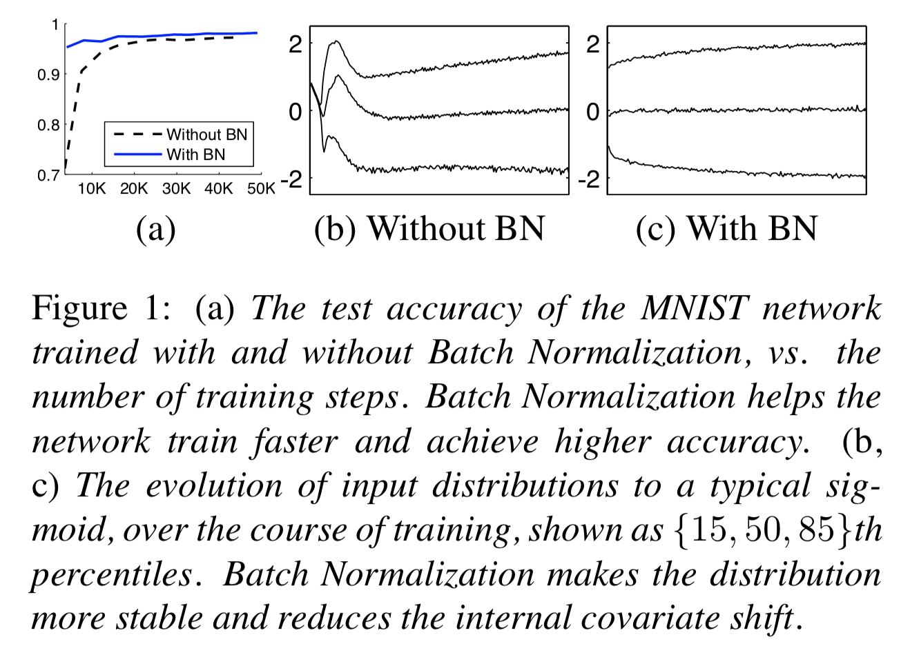

# Batch Normalization: Accelerating Deep Network Training by Reducing Internal Covariate Shift

#### Sergey Ioffe, Christian Szegedy ( Google Inc., 2015)

### Introduction : Internal Covariate Shift?

* 딥러닝은 vision, speech 등 많은 분야에서 월등히 우수한 성능을 보이고 있다. 특히 SGD를 이용해 딥러닝 모델을 빠르게 학습시킬수 있다.  

* SGD를 사용할 때 미치배치를 이용해 전체 트레이닝 데이터의 그래디언트를 추정할수 있다. 개별 샘플 m개에 대해 일일히 계산하는 것보다 배치단위로 계산하기 때문에 계산 효율성이 좋다. 

* SGD가 간단하고 효과적이지만, 하이퍼 파라미터(러닝 레이트)나 가중치의 초기값에 민감하여 세밀한 튜닝이 필요하다. 각 레이어의 인풋값은 그 다음 레이어들의 파라미터에 영향을 주기 때문에 하이퍼 파라미터로 인한 작은 변화가 레이어를 거치면서 증폭되기 때문이다. 

* 특히 인풋 데이터의 분포가 변할 경우 새로운 분포에 대해서 지속적으로 적응해야하기때문에 문제가 된다. 학습 시스템에서 입력데이터의 분포가 변하는 것을 Convariate shift라고 하면 일반적으로 도메인 어답데이션을 통해서 문제를 해결한다. 

* 네트워크의 서브 파트에서도 covariate shift와 같은 현상이 일어 난다. 이를 Internal Covariate Shift라고 지칭하자. 
	* 레이어가 2개인 네트워크 F2(F1(u, Θ1), Θ2)를 생각해보자
	* Θ2 를 학습시키는 것은 F1의 아웃풋 x = F1(u, Θ1) 를 입력으로 받아 서브 네트워크를 학습하는 것과 같다. 
	* 따라서 F2 입장에서는 입력값인 x의 분포를 고정시켜놓음으로써 x의 분포 변화에 따라 파라미터를 재조정할 필요가 없도록 하는 것이 좋다.  

* 서브네트워크 밖에서도 영향을 준다. - 시그모이드와 같이 saturating nonlinear activation function을 사용하는 경우
	* z = g(Wu + b)
	* g(x)는 x의 절대값이 커질수록 g'(x)가 0에 가까워진다. 즉 gradient가 vanishing된다.
	* x는  파라미터 W, b 외에 이전의 레이어의 파라미터 모두에 영향을 받기때문에 학습이 진행되는동안 파라미터의 변화로 인해 x가 비선형의 포화 영역으로 이동하게 되어 결과적으로 수렴 속도가 느려지게 된다. 
	* 학습 시 비선형 활성함수의 입력값을 stable하게 만들 경우, 옵티마이저가 staurated regime에 갇히지 않아 학습이 더 빨라질수 있을것이다. 

* 본 논문에서는 Internal covariate shift를 해결하기 위해서 Batch Normalization이라는 새로운 메카니즘을 제안하였다. 

* Batch Normalization는 각 레이어의 인풋값들의 평균과 분산을 고정시킴으로써 Internal covariate shift를 감소시키고, 딥러닝 네트워크의 학습속도을 극적으로 가속시키는 효과를 가져온다. 
	* 학습 파라미터의 스케일이나, 초기값에 대한 의존성을 감소시켜 전체 네트워크의 그래디언트에 긍정적인 효과를 준다.
	* 발산 위험성없이 더 높은 러닝레이트를 사용할수 있도록 한다. 
	* regularizer 역할을 하여 dropout과 같은 기법을 사용할 필요가 없게 된다.
	* saturated mode에 빠질 위험성을 제거하여 saturating nonlinearities 활성함수를 자유롭게 사용할수 있게 된다.

### Towards Reducing Internal Covariate Shift

* 인풋데이터를 whiten 시키면 네트워크가 더 빨리 수렴한다는 것은 이미 잘 알려진 사실이다. (LeCun et al., 1998b; Wiesler & Ney, 2011)

	* whiten이란? 상관관계를 없애고, 제로-평균과 유닛-분산을 갖도록 선형변환시키는 것. linearly transformed to have zero means and unit variances, and decorrelated.

* 앞서 설명한 것처럼, 각 레이어의 인풋은 이전 레이어들에 의한 아웃풋이므로, 모든 레이어의 인풋을 동일하게 whiten 시킴으로써 가속 효과를 기대할수 있다. 

* 이를 위해 우리는 매 스텝마다 activations을 whitening시키거나, 네트워크를 직접 수정하거나 또는 최적화 알고리즘의 파라미터를 바꾸는 등의 방식을 고려해볼수 있다. 하지만 whitening 변환이 최적화 단계에 포함되지 않고 떨어져있을 경우,노말리제이션 값이 업데이트 되어야만 파라미터가 업데이트되기 때문에 그래디언트 효과가 감소하게 된다.
	* 예를들어 입력값 u에 대해서 학습 파라미터 b를 더해주는 레이어와 레이어의 activation을 노말리제이션하는 것을 생각해보자 : x_hat = x - E[x] , x = u + b
	* 만약 그래디언트 디센트가 E[x]가 b에 의존한다는 것을 무시한다면, b <- b + ∆b , ∆b ∝ − ∂l / ∂(x_hat) 로 업데이트될 것이다. 
	* u + (b + ∆b) - E[u + (b + ∆b)]되어 결국 아웃풋에 아무런 변화를 주지 못하고, 손실 함수의 값도 그대로 남게 된다. 
	* 트레이닝이 계속될수록 b는 점차 증가하지만, 손실 함수 값은 변화가 없을 것이다. 

* 이 이슈를 해결하기 위해서는 네트워크 자체가 항상 원하는 분포의 activations 값을 만들어내도록 해야한다. 손실 함수의 그래디언트가 파라미터 값에 의존하는 노말리제이션을 고려하도록 말이다.
* 다만 이런 방식은 계산 효율 측면에서 expensive하다. covariate matrix와 그것의 inverse square root 등을 구해야하고, 백프로파게이션을 위해서는 그래디언트까지 구해야한다. 
* 따라서 미분가능하고 파라미터를 업데이트할때마다 전체 학습데이터를 분석할 필요가 없는 대안을 찾고자 하였다.

### Normalization via Mini-Batch Statistics

* 우리는 각 레이어의 인풋과 아웃픗을 jointly 화이트닝 시키는 것 대신에 각 피쳐들의 디멘션이 독립적이라고 가정하고, 디멘션별로 독립적으로 노말리제이션 한다. 
	* x = (x(1) ... x(d))
	*  </img>

* 이 때 단순히 노말리제이션할 경우, 레이어가 원래 가지고 있던 표현력이 변할수 있다. 예를 들어 시그모이트의 인풋을 노말리제이션 하면 전체 비선형 중에 선형의 영역밖에 표현되지 않는다. 
	* 이를 해결하기 위해 scale과 shift를 포함하는 선형 변형을 해준다. 감마와 베타는 모델 파라미터와 함께 학습되는 파라미터이다.
	*  </img>

* 또한 전체 트레이닝 데이터넷에 대한 노말리제이션을 고려할수 있지만, stochastic optimization이라는 가정하에 각 미니-배치에 기반한 평균과 분산 추정치를 계산한다. 

* 전체적으로 batch normalizing transform은 아래와 같이 정의된다.
	*  </img>

*   γ,β 그리고 모델 파라미터 업데이트를 위한 backpropagation에 사용되는 chain rule은 다음과 같이 계산된다.
	*  </img>

#### Training and Inference with Batch- Normalized Networks
* 앞서 정의한 Batch normalizing transform은  train 과정에서는 mini-batch의 sample mean/variance를 사용한다. 하지만 인퍼런스에서도 그 규칙을 그대로 사용하는 것은 바람직하지 않다. 
* 우리는 input에 따른 deterministic output를 얻기 위하여 미니배치 기반의 통계값이 아니라, 전체 데이터에 대한 통계값을 사용해야한다. 
* 인퍼런스에서는 학습과정에서 얻은 미니배치들의 평균, 분산들을 이용해 unbiased mean/variance estimator를 계산하여 이를 BN transform에 이용한다.

	*  </img>

#### Batch-Normalized Convolutional Networks
* 컨볼루션 레이어를 이용한 네트워크에서는 컨볼루션의 성질을 유지하기 위해 피쳐맵의 서로 다른 위치에 대해서 각 각 normalized 되어야한다. 즉, 채널 단위로 노말리제이션이 되며, γ(k)와  β(k) 도 채널 단위로 학습이 된다. 
* 예를 들어 mini-batch 사이즈가 m이고 convolution을 적용한 후의 feature map의 사이즈가 p x q 일 경우, 실제로 계산되는 배치 사이즈는 m'= m x p x q 개와 같다. 또한 gamma와 beta는 activation별로가 아닌 피쳐맵별로 학습된다. 

#### Batch Normalization enables higher learning rates
* 일반적으로 러닝 레이트값이 클수록 레이어를 통과할수록 가중치의 스케일이 커지거나 작아져서 vanishing 또는 exploding gradient를 야기하게 된다.
* 하지만 배치 노말리케이션을 사용함으로써 가중치의 작은 변화가 레이어를 거치면서 증폭되는 현상을 막을수 있다. 
* 실제로 가중치의 스케일이 커지면 배치노말리제이션을 통해 오히려 그래디언트가 더 작아져, 가중치가 exploding되는 것을 막는 효과가 이다. 

#### Batch normalization regularizes the model
* 학습과정에서 배치노말리제이션은 데이터를 개별 샘플이 아니라 같은 배치에 포함된 샘플과 동시에 계산하기 때문에 한개의 샘플에 대해서 deterministic한 값을 갖지 않는다.
* 이러한 효과로 인해 네트워크가 오버피팅하는 것을 막아주는 regularizer역할을 한다는 것을 실험적으로 확인하였다. 

### Experiemtns
* architecture and hyper-parameters
	* 3 fully connected layer with 100 acvation
	* sigmoid activation function
	* cross-entropy loss
	* 50000 epoch
	* batch size 60
	* orignal Network : N, Network with BN : NBN

</img>

* 학습이 진행될수록 배치노말리제이션을 사용한 네트워크가 더 높은 테스트 정확도를 보였다. 또한 마지막 레이어의 activation이 변화하는 것을 살펴봤을때, orignal network는 학습에 따라 평균과 분산 모두 급격한 변화를 보이지만 배치노말리제이션을 사용한 네트워크는 더 안정적인 변화를 보이는 것을 확인하였다. 

