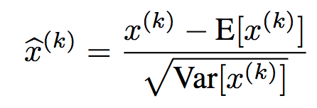
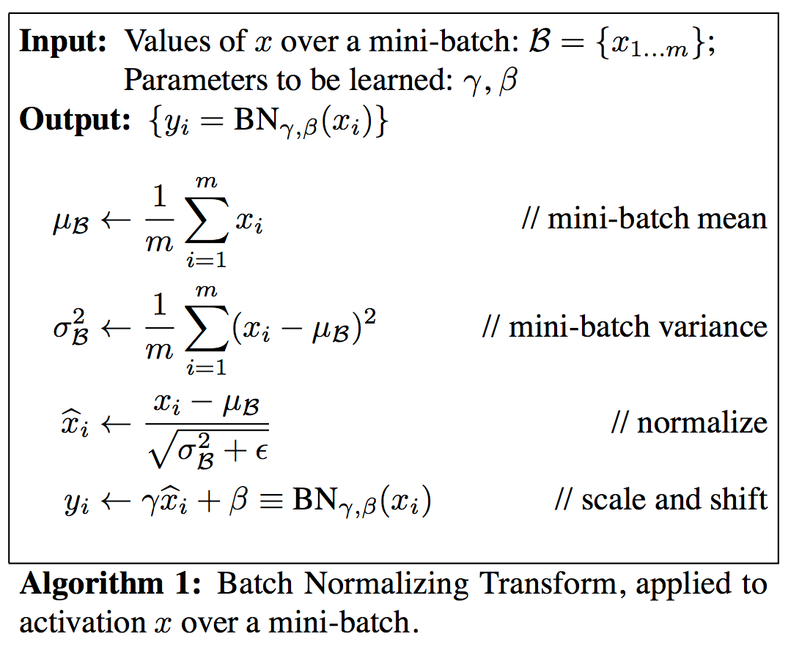
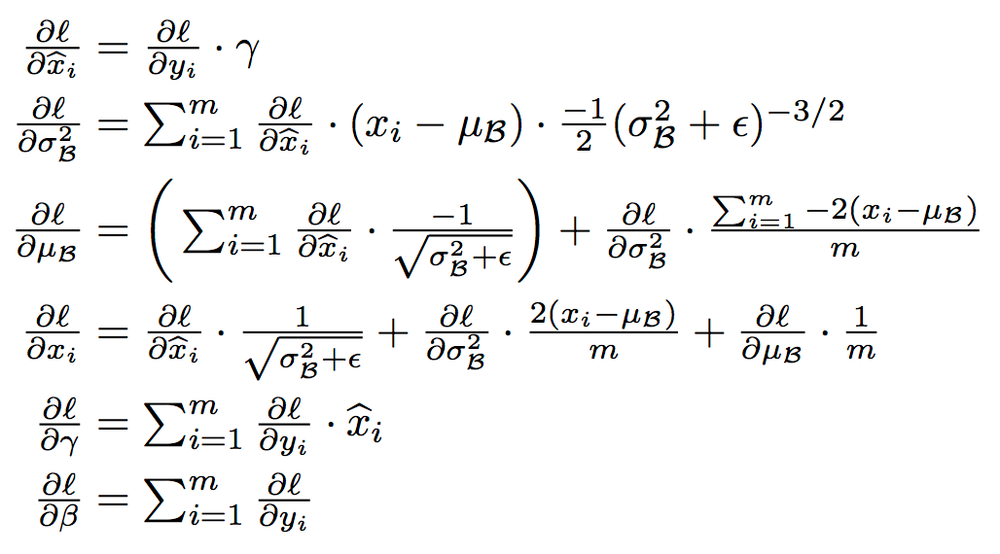
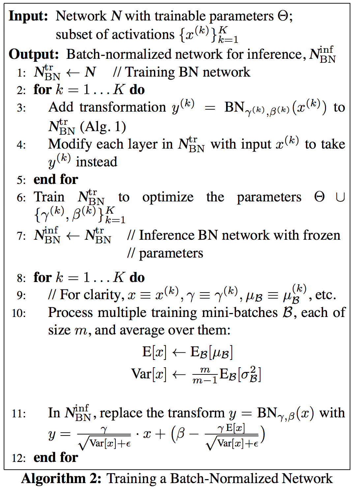

# Batch Normalization: Accelerating Deep Network Training by Reducing Internal Covariate Shift

### Sergey Ioffe, Christian Szegedy ( Google Inc., 2015)

# Introduction : Internal Covariate Shift?

* 딥러닝은 vision, speech 등 많은 분야에서 월등히 우수한 성능을 보이고 있다. 특히 SGD를 이용해 딥러닝 모델을 빠르게 학습시킬수 있다. 

* SGD을 사용할때 보통 mini-bach를 고려한다. 미니배치를 이요해 학습 파라미터에 대한 손실함수의 그래디언트를 추정할 수 있다. 

* 미치배치를 이용해 전체 트레이닝 데이터의 그래디언트를 추정할수 있다. (배치 사이즈가 커질수록 더 유사함) 또한 개별 샘플 m개에 대해 일일히 계산하는 것보다 배치단위로 계산하기 때문에 계산 효율이 좋다. (병렬처리로 인해)

* SGD가 간단하고 효과적이지만, 하이퍼 파라미터(러닝 레이트)나 가중치의 초기에 민감하여 세심하게 튜닝해주어야하는 이슈가 있다. 각 레이어의 인풋값은 그 다음 레이어들의 파라미터에 영향을 주기 때문에 작은 변화가 레이어를 거치면서 증폭되는 경향이 있다. 

* 인풋 데이터의 분포가 변할 경우 새로운 분포에 대해서 지속적으로 적응해야하기때문에 문제를 야기한다. 전체 학습 시스템에서 입력데이터의 분포를 변화는 것을 Convariate shift라고 하면 보통은 도메인 어답데이션을 통해서 해결한다. 

* 하지만 네트워크의 각 부분에서도 covariate shift와 같은 현상이 일어 난다. 이를 Internal Covariate Shift라고 지칭하도록 하겠다. 
	* 레이어가 2개인 네트워크 F2(F1(u, Θ1), Θ2)를 생각해보자
	* Θ2 를 학습시키는 것은 F1의 아웃풋 x = F1(u, Θ1) 를 입력으로 받아 서브 네트워크를 학습하는 것과 같다. 
	* 따라서 F2 입장에서는 입력값인 x의 분포를 고정시켜놓아 x의 분포 변화에 따라 재조정될 필요가 없도록 하는 것이 좋다.  

* 서브네트워크 밖에서도 영향을 준다. - 시그모이드와 같이 saturating nonlinear activation function을 사용하는 경우
	* z = g(Wu + b)
	* g(x)는 x의 절대값이 커질수록 g'(x)가 0에 가까워진다. 즉 gradient가 vanishing된다.
	* x는  파라미터 W, b 외에 이전의 레이어의 파라미터 모두에 영향을 받기때문에 학습이 진행되는동안 이 파라미터의 변화로 인해  x는 비선형의 포화 영역으로 이동시키고 결과적으로 수렴 속도가 느려지게 된다. 
	* 따라서 학습이 진행되는동안 비선형 활성함수의 입력값을 stable하게 만들경우, 옵티마이저가 staurated regime에 갇히지 않고 학습이 더 빨라질수 있을것이다. 

* 본 논문에서는 Internal covariate shift를 해결하기 위해서 Batch Normalization이라는 새로운 메카니즘을 제안하였다. 

* Batch Normalization는 각 레이어의 인풋값들의 평균과 분산을 고정시킴으로써 Internal covariate shift를 감소시키고, 딥러닝 네트워크의 학습속도을 급격하게 가속시키는 효과를 가져온다. 
	* 학습 파라미터의 스케일이나, 초기값에 대한 의존성을 감소시켜 전체 네트워크의 그래디언트에 긍정적인 효과를 준다.
	* 발산 위험성없이 더 높은 러닝레이트를 사용할수 있도록 한다. 
	* regularizer 역할을 하여 dropout과 같은 기법을 사용할 필요성을 없애준다.
	* saturated mode에 빠질 위험성을 제거하여 saturating nonlinearities 활성함수를 사용할수 있게 한다. 

# Towards Reducing Internal Covariate Shift

* 인풋데이터를 whiten 시키면 네트워크가 더 빨리 수렴한다는 것은 잘 알려진 사실이다. (LeCun et al., 1998b; Wiesler & Ney, 2011)

	* whiten? linearly transformed to have zero means and unit variances, and decorrelated.

* 앞서 설명한 것처럼, 각 레이어의 인풋은 이전 레이어들에 의한 아웃풋이므로, 모든 레이어의 인풋을 동일하게 whiten 시킴으로써 학습 가속 효과를 기대할수 있다. 

* 이러한 수정에 최적화 단계가 산재 해있는 경우 그래디언트 강하 단계는 정규화가 업데이트되어야하는 방식으로 매개 변수를 업데이트하려고 시도 할 수 있으며 그래디언트 단계의 영향을 감소시킵니다.
TBU

# Normalization via Mini-Batch Statistics

* 각 레이어의 인풋과 아웃픗을 jointly 화이트닝 시키는 것 대신에 각 피쳐들의 디멘션을 독립적으로 노말리제이션 한다. 
	* x = (x(1) ... x(d))
	*  </img>

* 이 때 단순히 노말리제이션할 경우, 레이어가 원래 가지고 있던 표현력이 변할수 있다. 예를 들어 시그모이트의 인풋을 노말리제이션 하면 전체 비선형 중에 선형의 영역밖에 표현되지 않는다. 
	* 이를 해결하기 위해 scale과 shift를 위한 선형 변형을 해준다. 감마와 베타는 모델 파라미터와 함께 학습되는 파라미터이다.
	*  </img>

* 또한 전체 트레이닝 데이터넷에 대한 노말리제이션을 고려할수 있지만, stochastic optimization이라는 가정하에 각 미니-배치에 기반한 평균과 분산 추정치를 계산한다. 

* 전체적으로 batch normalizing transform은 아래와 같이 정의된다.
	*  </img>

*   γ,β 그리고 모델 파라미터 업데이트를 위한 backpropagation에 사용되는 chain rule은 다음과 같이 계산된다.
	*  </img>

## Training and Inference with Batch- Normalized Networks
* 앞서 정의한 Batch normalizing transform은  train 과정에서는 mini-batch의 sample mean/variance를 사용한다.
* inference를 할 때에도 같은 규칙을 적용하게 되면 mini-batch 세팅에 따라 inference가 변할 수도 있기 때문에 각각의 test example마다 deterministic한 결과를 얻기 위하여 sample mean/variance 대신 그 동안 저장해둔 sample mean/variance들을 사용하여 unbiased mean/variance estimator를 계산하여 이를 BN transform에 이용한다.

	*  </img>

## Batch-Normalized Convolutional Networks
* 

## Batch Normalization enables higher learning rates

