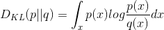
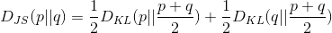
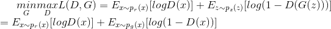
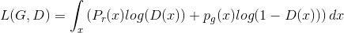
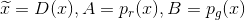
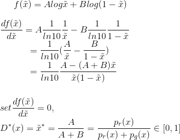
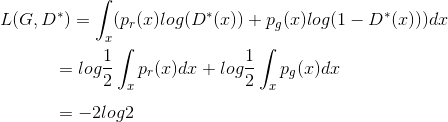

* 이 글은 https://lilianweng.github.io/lil-log/2017/08/20/from-GAN-to-WGAN.html 를 동의하에 번역한 글입니다.

# From GAN to WGAN

이 포스트는 generative adversarial netowrk (GAN) model에 사용되는 수식과 GAN이 왜 학습하기 어려운지를 설명합니다. Wasserstein GAN은 두 분포간의 거리를 측정하는데 더 향상된(smoooth한) 메트릭를 사용하여 GAN의 학습과정을 개선하였습니다.

Generative adversarial network(GAN)은 이미지나 자연어, 음성과 같은 현실의 다양한 컨텐츠를 생성하는 분야에서 큰 성과를 보여주고 있습니다. generator와 discriminator(a critic) 두 모델이 서로 경쟁하듯 학습되어 동시에 서로의 성능이 올라가는 게임 이론에 근본을 두고 있습니다. 하지만 GAN의 학습이 불안정하거나 실패로 이어지는 경우가 많아, 최적값에 수렴된 모델로 학습하는 것은 어려운 문제입니다. 

여기서는 GAN에 사용되는 수식들을 설명하고자 하며, 왜 학습이 어려운지, 그리고 학습의 어려움을 해결하기 위해 향상된 GAN을 소개하고자 합니다. 

### Kullback–Leibler and Jensen–Shannon Divergence

GAN을 자세히 설명하기 전에 두 분포사이의 유사도를 정량화하는 두 가지 메트릭을 살펴보도록 하겠습니다. 

1) [KL(Kullback - Leibler) divergence](https://en.wikipedia.org/wiki/Kullback%E2%80%93Leibler_divergence) 는 <i>p</i> 분포가 다른 분포 <i>q</i>와 얼마나 떨어져 있는지를 측정합니다. 

    </img>

DKL는 p(x)==q(x)일때 최소값 zero 입니다.
KL divergence는 비대칭적인 형태라는 점을 기억해두시길 바랍니다. 또한 p(x)가 0에 가깝고 q(x)가 non-zero일 경우, q의 효과는 무시됩니다. 이로 인해 두 분포를 동등하게 사용하여 유사도를 측정하고자 할때 잘못된 결과를 얻을수 있습니다.

2) [Jensen-Shannon Divergence](https://en.wikipedia.org/wiki/Jensen%E2%80%93Shannon_divergence) 는 두 분포의 유사도를 특정하는 다른 메트릭으로 [0, 1] 사이값을 갖습니다. JS divergence는 대칭적입니다(야호!) 그리고 더 스무스(smooth)합니다. KL divergence와 JS divergence를 더 자세히 비교하는 내용은 이 [Quora post](https://www.quora.com/Why-isnt-the-Jensen-Shannon-divergence-used-more-often-than-the-Kullback-Leibler-since-JS-is-symmetric-thus-possibly-a-better-indicator-of-distance)를 참고하세요.

    </img>

</img>

<i>Fig.1. 두 가우시안 분포, p는 평균 0과 분산 1이고 q는 평균 1과 분산 1. 두 분포의 평균은 m=(p+q)/2. KL divergence는 비대칭적이지만 JS divergence는 대칭적이다. </i>

### Generative Adversarial Network (GAN)

GAN은 두 모델로 이루어져있습니다.

* discriminator D는 주어진 샘플이 실제 데이터셋에서 나왔을 확률을 추정합니다. 감별사 역할로 실제 샘플과 가짜 샘플을 구분하도록 최적화되어 있습니다.
* generator G는 노이즈 변수인 z(z는 잠재적으로 출력의 다양성을 나타냅니다)를 입력으로 받아 위조된 샘플을 만듭니다. 실제 데이터의 분포를 모사하도록 학습되어 생성한 샘플은 실제 데이터의 샘플과 유사하며, discriminator를 속이는 역할을 합니다.

</img>

<i>Fig.2. GAN의 구조 (출처 : [여기](https://www.kdnuggets.com/2017/01/generative-adversarial-networks-hot-topic-machine-learning.html))</i>

학습과정에서 두 모델은 경쟁구조에 놓여 있습니다: G는 D를 속이려고 하고, 동시에 D는 속지 않으려고 합니다. zero-sum 게임에서 두 모델은 각자의 기능을 최대로 향상시킴으로써 서로의 목적을 달성하게 됩니다. 

| Symbol | Meaning | Notes
---------|---------|----
pz | 노이즈 입력값 z의 분포 | 보통, uniform|
pg | data x에 대한 generator의 분포| |
pr | 실제 샘플 x에 대한 데이터 분포 | |
---

우리는 실제 데이터에서 뽑힌 샘플 x의 D의 감별 확률이 높기를 원합니다. 반면에 생성된 샘플 G(z)에 대해서는, z ~ pz(z), D의 감별결과값 D(G(z))이 zero에 가깝기를 원합니다. 즉, Ex ~ pr(x)[logD(x)]와 Ez ~ pz(z)[log(1-D(G(z))]가 최대화되길 원합니다. 

하지만 G는 위조된 샘플이 D가 높은 확률로 진짜 데이터라고 판단하도록 학습됩니다. 그래서 Ez ~ pz(z)[log(1-D(G(z))]가 최소화되길 원합니다.

이 두 가지를 합쳐서, D와 G는 minmax game을 하게 되고 아래와 같은 손실함수를 최적화하도록 설계되어 있습니다. 

</img>

(Ex ~ pr(x)[logD(x)]는 그래디언트 디센트 업데이트에서 G에 아무런 영향을 주지 않습니다.)

### What is the optimal value for D?
자, 이제 잘 정의된 손실함수를 이용해 D에 대해서 가장 최적화된 값을 찾아보도록 하겠습니다.

</img>

우리는 L(G, D)를 최대화는 최적의 D(x)값을 찾는 것이 목적입니다. 아래와 같은 라벨을 사용하여 인테그랄 안쪽의 식을 다시 나타내도록 하겠습니다. (x는 가능한 모든 경우에 대해서 샘플된 값이기때문에 인테그랄은 무시해도 됩니다.)

</img>

</img>

일단 generator가 최적으로 학습이 된다면, pg는 pr에 매우 가까워질것입니다. pg = pr 가 되면, D\*(x)은 1/2가 됩니다.

### what is the global optimal?
G와 D 모두 최적값일때, pg = pr이고, D\*(x)=1/2가 되어 손실함수는 -2log2가 됩니다.

</img>

### what does the loss function represent?
앞서 설명한 JS divergence를 적용하여 pr과 pg 사이의 JS divergence는 아래처럼 계산됩니다.

</img>

즉, 핵심은 discriminator가 최적으로 학습되었을때 GAN의 손실함수는 데이터에 의해 생성된 분포 pg와 실제 샘플데이터의 분포 pr 사이의 유사도를 JS divergence로 정량화하는 것과 같습니다. 실데 데이터 분포를 모사하는 최적의 G\*는 최소값으로 L(G\*, D\*) = -2 log2 가 됩니다. 

* GAN의 변형체 : 서로 다른 목적의 문제 상황을 풀기 위한 GAN의 다양한 변형체들이 존재합니다. 예를 들어 semi-supervised learning에서 discriminator가 fake (label : K)를 구분하는 것뿐만아니라 실제 클래스 라벨(label : 1, ..., K-1)를 구분하도록 학습시키는 구조가 있습니다. 이때 generator의 목적은 K보다 작은 값으로 분류되도록 하여 discriminator를 속이는 것 입니다.

<b> Tensorflow Implementation </b> : [carpedm20/DCGAN-tensorflow](https://github.com/carpedm20/DCGAN-tensorflow)

## problems in GANS
GAN이 실제 이미지 생성에서 좋은 성능을 보이고 있지만, 학습하는 것이 쉬운 일은 아닙니다. 일반적으로 학습 과정이 느리고 불안정한 것으로 알려져 있습니다.

### hard to achieve Nash equilibrium
[Salimans et al. (2016)](http://papers.nips.cc/paper/6125-improved-techniques-for-training-gans.pdf) 에서는 그래디언트 하강 방식 기반으로 GAN을 학습할 때 생기는 문제점들을 논의하였습니다. 두 모델이 내쉬 균형을 찾기 위해서 동시에 학습됩니다. 하지만 각 모델은 게임 내 다른 플레이어와 관련없이 손실함수를 독립적으로 업데이트합니다. 두 모델의 그래디언트를 동시에 업데이트한다고해서 수렴이 반드시 보장되는 것은 아닙니다. 

비협동적인 게임에서 내쉬 균형을 찾는 것이 왜 어려운지 이해하기 위해 간단한 예를 확인해보도록 하겠습니다. 한 플레이어는 f1(x) = xy를 최소화하기 위해 x를 업데이트하고, 다른 플레이어는 f2(y) = -xy를 최소화하기 위해 y를 업데이트하는 상황을 가정해보도록 하겠습니다. 

∂f1/∂x = y, ∂f1/∂x = -x이기 때문에 한 iteration에서 x와 y는 각 각 x - η⋅y와 y + η⋅x로 동시에 업데이트 됩니다(η는 러닝 레이트임). x와 y가 서로 다른 부호를 가지면, 다음의 모든 그래디언트 업데이트는 진동하게 되고 그림3과 같이 불안정성이 시간이 갈수록 심해지는 경향으로 나타납니다.  

</img>

<i>Fig.3. xy를 최소화하도록 x를 업데이트하고, -xy를 최소화하기 위해 y를 업데이트하는 상황을 시뮬레이션한 결과(러닝레이트 η =0.1) iteration이 증가할수록 진동폭이 점점 커지고 불안정해지는 현상이 나타납니다.</i>

### Low dimensional supports
| Term | Explanation 
---------|---------
[Manifold](https://en.wikipedia.org/wiki/Manifold)  | 각 포인트 근처의 유클리드 공간과 지역적으로 유사한 토폴로지 공간. 정확하게,이 유클리드 공간이 차원 n 인 경우, 매니폴드는 n - 매니폴드라고합니다. |
[Support](https://en.wikipedia.org/wiki/Support_(mathematics))  | 실수형 함수 f는 0으로 매핑되지 않은 요소들을 포함하는 도메인의 하위 집합입니다. 

[Arjovsky and Bottou (2017)](https://arxiv.org/pdf/1701.04862.pdf) 에서는 저차원 매니폴드(Manifold) 공간에서의 pr과 pg의 서포트(Support) 문제를 다루고, 매우 이론적인 방법으로 그것들이 어떻게 GAN 학습과정의 불안정성(instability)을 야기하는지 논의하였습니다.

실제 세상의 데이터의 차원은 (pr로 나타내어지는 데이터) 인위적으로 매우 높은 차원으로 표현하지만, 저차원 매니폴드에서는 매우 밀집된 형태로 나타납니다. 사실 이것은 [Manifold learning](http://scikit-learn.org/stable/modules/manifold.html)의 기본 가정에 해당합니다. 실제 세상에 존재하는 이미지를 생각하면, 일단 테마나 포함된 객체가 고정되면, 이미지는 많은 제약조건을 갖게 됩니다. 예를 들어 강아지는 두개의 귀와 꼬리 하나를 가져야하고, 초고층 건물은 기다란 직선형이어야합니다. 이러한 제약사항들로 인해 이미지들은 고차원 공간의 자유로운 형태와 멀어지게 됩니다.

pg 역시 저차원 매니포드 공간에 놓여있습니다. generator가 100차원 노이즈 인풋 z를 이용해 64x64와 같이 더 큰 차원의 이미지를 생성해야할 경우, 4096 픽셀들의 컬러 분포는 100차원의 작은 랜덤 넘버 벡터에 의해 결정되며 이 때 고차원의 공간 전체를 거의 채울 가능성은 매우 낮습니다. 

결론적으로 pg와 pr이 저차원 매니포드 공간에 놓여있기때문에, 두 분포는 <i>fig.4</i>처럼 거의 확실하게 분리가능(disjoint)할 것입니다. 두 분포가 서로 분리할수있는 서포트를 갖을 경우, 우리는 항상 진짜와 가짜 샘플을 100% 구분할수 있는 완벽한 discriminator를 찾을수 있습니다. (증명과정이이 궁금하다면 [이 논문](https://arxiv.org/pdf/1701.04862.pdf)을 참조하세요.)

</img>

<i>Fig.4. 고차원공간에서 저차원 매니폴드는 거의 서로 겹치지 않습니다.왼쪽의 3차원 공간에서 두 직선처럼요. 또는 오른쪽의 3차원공간에서 두 평면처럼요.</i>

### Vanishing gradient
만약 discriminator가 완벽하다면, 우리는 D(x) = 1 ∀x ∈ pr와 D(x) = 0 ∀x ∈ pg를 확신할수 있습니다. 따라서 손실함수 L은 0에 가까워지고, 학습 과정에서 loss를 업데이트할수 있는 gradient를 얻지 못하여 결국 학습이 종료됩니다. fig.5는 discriminator가 점점 좋아질수록 gradient가 더 빨리 사라지는(vanish) 현상을 나타냅니다. 

</img>

<i>Fig.5.먼저 DCGAN 모델을 1, 10, 25 epoch만큼 학습시킵니다. 그리고, <b>generator는 고정시킨채<b>, discriminator를 학습시키면서 손실함수의 gradient를 측정하였습니다. 4000번의 이터레이션 후에 5 order 수준으로 gradient가 빠르게 감소하는 것을 볼수 있습니다(in best case = after 1 epoch, Image source: [Arjovsky and Bottou, 2017)](https://arxiv.org/pdf/1701.04862.pdf)) </i>

결론적으로, GAN을 학습시키는 것은 아래와 같은 딜레마를 격게 됩니다:
* 만약 discriminator가 잘못된 판단하게 될 경우, generator는 정확한 피드백을 받지 못하게 되고 손실함수는 현실을 반영하지 못하게 됩니다.
* 만약 discriminator가 매우 정확하게 판단하게 될 경우, 손실함수의 gradient가 0에 가까운 값으로 빠르게 떨어지고 학습 속도가 현저히 늦어지거나 심지어 방해가 됩니다.

이 딜레마는 분명히 GAN 학습을 매우 어렵게 만듭니다. ㅠ_ㅠ

### Mode collapse
학습과정에서 generator가 항상 동일한 아웃풋을 만들어낼수도 있습니다. 이 살패 현상은 'Mode Collapse'라고 부르며, GAN 학습과정에서 흔하게 발생합니다. 비록 generator가 discriminator를 속이는 데는 성공하였지만, 실제 데이터의 복잡한 분포를 학습하는데 실패하고 극단적으로 낮은 다양성을 갖는 작은 공간 안에 갇혀버린 경우입니다.

</img>
<i>Fig. 6. 학습된 DCGAN(MLP network with 4 layers, 512 units and ReLu activation function)에 의해 생성된 이미지들로 mode collapse 현상을 보이고 있습니다. Image source : [Arjovsky, Chintala, & Bottou, 2017.](https://arxiv.org/pdf/1701.07875.pdf)</i>

### Lack of a proper evaluation metric
GAN은 태생적으로 학습 진행과정을 알려주는 적절한 목적 함수가 없습니다. 적절한 평가 지표 없이는 어둠 속에서 학습이 진행되는 것과 같습니다. 언제 학습을 중단해야하는지, 복수개의 모델 중 어떤 것이 더 나은지 등을 판단하기 어렵습니다.

## Improved GAN Training
여러 연구를 통해 안정된 GAN 학습을 위해 아래와 같은 방법들이 도입되었습니다.
앞의 다섯가지 방법은 ["Improve Techniques for Training GANS"](http://papers.nips.cc/paper/6125-improved-techniques-for-training-gans.pdf)에서 제안된 방법으로 GAN이 더 빠르게 수렴할수 있도록 하는 실용적인 기법들입니다. 마지막 두가지 방법은 [“Towards principled methods for training generative adversarial networks”](https://arxiv.org/pdf/1701.04862.pdf)에서 제안한 방법으로 disjoint distribution 문제를 해결하기 위해 사용되었습니다.

<b>(1) Feature Matching </b>
 

